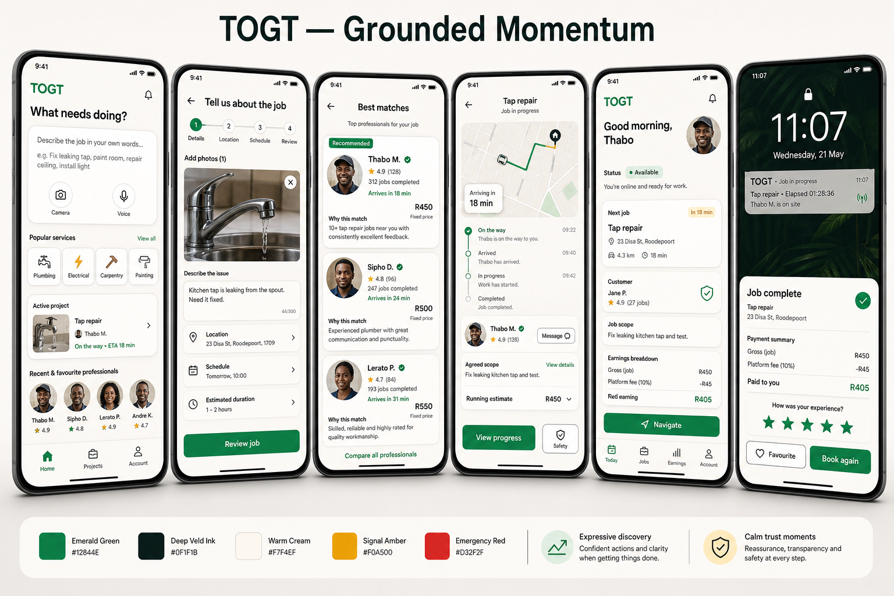

# TOGT Grounded Momentum — Master Product, UX and Delivery Specification

| Field | Value |
|---|---|
| Date | 2026-08-23 |
| Status | Approved build specification v1; accelerated execution baseline, not production deployment approval |
| Scope | Phase 0 through Phase 4 |
| Target | Android-first two-sided labour marketplace, with iOS-compatible architecture |
| Visual direction | Grounded Momentum |
| Owner | TOGT |
| Executable plan | `docs/superpowers/plans/2026-08-23-togt-grounded-momentum-full-build-plan.md` |
| Implementation handoff | `docs/superpowers/plans/2026-08-23-togt-grounded-momentum-full-build-handoff.md` |



## Existing APK and source baseline

The full build starts from the existing reviewed source and installed-test artifact. It does not restart the product and it does not decompile or edit the APK binary.

| Baseline item | Recorded value |
|---|---|
| Source branch | `codex/mobile/internal-apk-readiness-2026-08-23` |
| Source commit | `66cd45822e4958edc5be97af418bc4f674ce932f` |
| Base `origin/main` | `389c81dcf21829472dfd174fadaff00a2cbf0721` |
| Internal artifact | `TOGT-LAN-Test-1.0.0-2026-08-23-arm64.apk` |
| Application identity | `za.togt.app`, `versionName 1.0.0`, `versionCode 1` |
| Android target | minimum SDK 24, target/compile SDK 36, `arm64-v8a` |
| Artifact SHA-256 | `604E6F1F7E6518F5F430745E2ED63260FD70E2716EA0D8FFB70CB4E28B8228E2` |
| Signing evidence | Internal Android debug certificate; signer SHA-256 `FAC61745DC0903786FB9EDE62A962B399F7348F0BB6F899B8332667591033B9C` |
| Build route | Local Android Gradle build; no Expo Go, Expo account or EAS cloud build required |
| Baseline checks | 12/12 mobile configuration tests, 18/18 Expo Doctor checks, standalone bundle present, APK aligned and signature verified |

This artifact is an internal, synthetic-data, private-LAN test build. It is not a public beta, production build, Play Store signing identity or authorization for real identities or money.

Implementation rules:

- Preserve the artifact as the regression and rollback baseline.
- Converge its source changes onto a fresh task branch according to the repository worktree and promotion runbook before broader implementation.
- Every successor APK keeps `za.togt.app`, uses a monotonically higher `versionCode` and records its signer, ABI set, checksum and source commit.
- The first P0 successor targets `versionCode 2`. If another approved artifact consumes that code first, use the next higher unused code.
- An in-place upgrade requires the same signing certificate. A deliberate signer change requires a documented clean-uninstall test and cannot be presented as an upgrade.
- The development API may remain private-LAN HTTP only for clearly labelled internal builds. Preview and production remain HTTPS/WSS-only.

## 1. Purpose

This document turns the approved Grounded Momentum concept into a build-ready specification. It defines what TOGT must do, how it should feel, which states and safeguards it must support, how the work is sequenced, and the evidence required before each phase can ship.

This specification is intentionally broader than a visual redesign. The finished interface cannot be trusted unless navigation, matching, location, scope, payment, KYC, safety, offline behaviour and worker economics all derive from the same server-authoritative product model.

The target lifecycle is:

```text
Need
→ structured job brief
→ matching mode
→ worker/offer
→ price and schedule agreement
→ worker en route
→ arrival and start PIN
→ agreed work and approved changes
→ completion confirmation
→ payment
→ rating, favourite and rebook
```

## 2. Authority and decision order

When implementation details conflict, use this order:

1. Explicit TOGT product decisions made after this document.
2. Privacy, security and POPIA requirements in `docs/privacy/` and the customer-data-safety design.
3. This master specification.
4. Approved phase implementation plans derived from this specification.
5. Existing implementation behaviour.

The stricter safety, privacy or payment-integrity rule wins when two requirements appear equivalent.

## 3. Product outcome

TOGT should feel:

- **Grounded:** clear facts, authentic people, stable layouts, transparent money, truthful verification and calm safety interactions.
- **In motion:** every screen has one obvious next step, state changes are visible, and every action receives immediate feedback.
- **Local:** South African English, ZAR pricing, realistic addressing, representative people, locally appropriate payments and weak-connectivity resilience.
- **Two-sided:** customer convenience may not come at the expense of worker information, earnings, safety or control.

The north-star metric is **Trusted Completed Jobs per week**.

A trusted completed job is one where:

- fulfilment reached confirmed completion;
- payment reached a reconciled successful state;
- no unresolved dispute, refund or safety escalation exists inside the agreed quality window.

## 4. Non-negotiable product principles

1. The server-authoritative state model is the product contract.
2. Discovery may be expressive; identity, address, scope, money and safety must be calm and predictable.
3. The map is contextual, not the customer home screen.
4. One service taxonomy, worker identity and price source feeds every surface.
5. A typed address and its coordinates must describe the same confirmed place.
6. A commercial agreement is versioned and immutable; later additions are append-only change orders.
7. A job cannot start without required bilateral scope confirmation and a customer-controlled start PIN.
8. Completion is bilateral: worker requests completion; customer confirms, disputes or reaches a disclosed timeout outcome.
9. Payment success is server verified. Client taps never create a paid state.
10. Safety is an operated service, not merely an icon or database row.
11. Verification badges describe separate proven facts. Identity verification is not a background check, skills check or insurance.
12. Exact location and contact details are revealed only when operationally necessary.
13. Offline and failure states are visible. High-consequence actions never appear successful without acknowledgement.
14. AI may assist and structure; people confirm scope, price, worker, payment, verification and safety decisions.
15. Every phase ships behind a rollback mechanism and includes analytics, accessibility and support readiness.

## 5. Terminology

Use the following customer-facing vocabulary consistently:

| Term | Meaning |
|---|---|
| Worker | Person offering and performing work. `labourer` may remain an internal/API term. |
| Customer | Person requesting work. |
| Service | A versioned, bookable skill offering with requirements and a pricing mode. |
| Job | A requested or confirmed engagement between customer and worker. |
| Fast Match | A timed request to eligible workers for suitable fixed/hourly jobs. |
| Compare Workers | A scheduled selection flow using standardized worker cards. |
| Receive Quotes | A diagnostic/complex-work flow where complete offers are compared. |
| Project | The customer-facing home for an active, upcoming or completed job. |
| Change order | A versioned, priced addition to accepted scope that requires approval. |

Avoid using `task`, `trip`, `ride`, `gig` or `booking` interchangeably in customer copy. `Booking` may remain an engineering domain noun.

## 6. Scope and non-goals

### In scope

- APK/release stabilization.
- Canonical lifecycle, service and commercial models.
- Grounded Momentum brand and component system.
- Customer intent, brief, matching, project, payment and retention journeys.
- Worker activation, offers, fulfilment, earnings and account journeys.
- KYC truthfulness, privacy, safety, offline and weak-signal behaviour.
- Push, realtime updates and platform live status.
- Typed/voice/photo-assisted job intake with human confirmation.
- Analytics, experiments, observability, testing and staged rollout.

### Not in scope without a separate approval

- A complete backend rewrite.
- Mandatory instant booking for every service.
- Escrow claims without an approved legal/payment structure.
- Transport or e-hailing services.
- Always-on background location.
- Public permanent tracking links.
- Automated KYC, dispute or safety adjudication by AI.
- Membership before repeat-value evidence exists.
- Advertising inside booking, live work, payment or safety surfaces.
- A large super-app service grid.
- Production deployment or real-data migrations merely because this spec exists.

### Accelerated implementation profile

TOGT executes this programme through evidence-gated build waves rather than calendar promises. Frontier coding agents may implement, test and review independent lanes in parallel under one integration owner. A prior human-team estimate is planning context only; it is not the execution target for this build.

The accelerated profile is:

- reuse the existing source baseline, local Android toolchain and APK evidence;
- keep backend/contracts, customer mobile, worker mobile/design and QA/release work parallel where their inputs are stable;
- give shared navigation roots, DTOs, migrations and state machines one integration owner;
- merge paired customer/worker lifecycle slices rather than disconnected screens;
- use feature flags and truthful capability-off fallbacks so unavailable providers do not block unrelated work;
- generate automated evidence continuously and reserve physical-device, provider, legal and operational wall-clock time for the gates that genuinely require it;
- replan from measured failures or dependency changes, not from conventional staffing assumptions.

The ten-star build bar means fast implementation with no reduction in state integrity, privacy, accessibility, payment safety, device evidence or rollback quality. Speed comes from parallelism, reuse and automation—not from skipping gates.

## 7. Users and core jobs to be done

### Customer

The customer needs to:

- describe an imperfectly understood problem in natural language;
- understand which service and booking mode applies;
- compare trustworthy workers and realistic prices;
- confirm an accurate job location and time;
- follow progress without repeatedly reopening the app;
- approve scope, additions and money deliberately;
- receive support when work, payment or safety goes wrong;
- retain a good worker and repeat successful work.

### Worker

The worker needs to:

- understand exactly what is required to become bookable;
- control services, rates, areas and availability;
- decide whether an offer is worth accepting using scope, travel and expected net earnings;
- navigate, arrive and prove a legitimate job start;
- protect agreed scope and request paid additions;
- know whether money is pending, paid or available;
- build repeat customer relationships without opaque ranking or penalties;
- access safety, support and appeal paths.

### Operations/support

Operations needs to:

- identify authoritative job, payment, verification and safety state;
- act without unnecessary access to personal data;
- reconcile payments and payouts;
- support cancellation, no-show, replacement, dispute and incident cases;
- use feature flags and kill switches;
- audit critical decisions and transitions.

### Launch account-role contract

For the core Phase 0–4 build, each account has one server-authoritative marketplace role: `customer` or `worker` (`labourer` may remain the internal compatibility value during migration). Registration selects the initial role; the client cannot mutate or spoof it. Customer and worker lifecycle testing uses separate synthetic accounts and, for realtime/device acceptance, separate devices. Dual-role entitlements and in-session role switching require a separately approved data/auth migration and are not implied by the two application shells.

## 8. Service classification and commercial model

Every service SKU must be versioned and define:

- `service_id` and `service_version`;
- canonical category and localized label;
- pricing mode;
- fulfilment/matching mode;
- risk and credential tier;
- required brief fields;
- allowed materials/change-order rules;
- minimum duration or call-out fee;
- cancellation policy;
- recurrence eligibility;
- worker eligibility requirements.

### Pricing modes

| Mode | Eligibility | Customer promise | Worker control |
|---|---|---|---|
| Fixed / instant | Inputs define scope and expected effort with low variance. | One clear price before confirmation; increases require an approved change order. | Worker opts into the SKU, area, slots and defined payout. |
| Hourly / estimated | Work is describable but duration varies. | Rate, estimated hours/range, estimated total and approval cap. | Worker sets or accepts rate and sees travel plus expected net. |
| Remote quote | The structured brief is sufficient for a worker to price, but the amount varies by worker/approach. | No final price until a complete quote is accepted; every quote states scope, exclusions, schedule and expiry. | Worker authors, withdraws or updates a versioned quote before acceptance. |
| Diagnostic visit | Site condition/testing is required before final work can be priced. | A separately booked call-out/diagnostic fee and deliverable; later work quote requires a second acceptance. | Worker accepts the visit, performs diagnosis, then submits a final-work quote or closes with findings. |
| Recurring overlay | Same scope has completed successfully and both parties agree. | Series schedule, rate, substitutions and cancellation terms. | Worker explicitly accepts availability and manages exceptions. |

Decision sequence:

1. If structured inputs reliably determine scope, time and materials, use Fixed.
2. Otherwise, if time is a fair controllable unit, use Hourly / estimated.
3. If the brief supports remote pricing but not a standard amount, use Remote quote.
4. If a site visit/testing is required, book a Diagnostic visit with its own fee and lifecycle, then quote the later work.
5. Offer recurrence only after a successful completed job.

`Urgent` and `Scheduled` are fulfilment modifiers, not pricing modes. Do not introduce surge pricing until policy, disclosure, worker payout and consumer testing are approved.

### Matching modes

- **Fast Match:** default for eligible simple fixed/hourly jobs.
- **Compare Workers:** scheduled jobs where selection matters.
- **Receive Quotes:** remote competitive quotes for complex but sufficiently described work.
- **Book Diagnostic Visit:** a scheduled paid visit, not a competitive remote quote, when on-site diagnosis is required.

The service configuration chooses the default mode. The UI must not combine all enabled modes into an ambiguous decision.

### Liquidity gates

Matching modes are enabled per service area only when measured supply supports them.

- Fast Match requires a configured minimum eligible-worker count and recent response-rate threshold.
- Compare Workers requires enough genuinely available choices to avoid a misleading one-card comparison.
- Receive Quotes requires enough qualified workers and a response SLA.
- `Now` is hidden when the area/service cannot support a credible response.
- Thin supply falls back truthfully to alternate times, an expanded approved area, a quote request or a waitlist—not a fake search animation.
- Thresholds, fallback order and customer copy are versioned by service/area and monitored for worker fairness.

### Launch supply contract

Public discovery and matching never use synthetic or fabricated workers. Before an area/service/mode is enabled for customer traffic, Operations provides a named pilot cohort of real eligible workers with approved verification, service opt-in, rates, service areas, availability and response coverage. Staging uses deterministic synthetic fixtures only. The Phase 2 minimum worker counterpart is exercised by a real separate actor/account; production never auto-accepts or simulates worker supply. When the measured cohort falls below the configured liquidity gate, the truthful fallback above applies.

## 9. Canonical lifecycle model

Do not overload a single `booking.status` with operational, payment, dispute and safety meaning.

### Layer A — Transactional status

Keep a small, stable status set for compatibility and authorization:

```text
pending → accepted → in_progress → completed
pending | accepted → cancelled
in_progress → terminated_after_start
```

`terminated_after_start` is a preserved terminal fulfilment outcome for unsafe, abandoned or otherwise stopped work after a legitimate start. It is not rewritten as `completed` or pre-start `cancelled`; settlement, refund, payout, dispute and safety domains resolve independently against the preserved history.

### Layer B — Operational phase

Operational progress is a canonical, auditable phase derived from server events/timestamps:

```text
matching
→ assigned
→ scheduled
→ en_route
→ arrived
→ scope_confirmation
→ work_active
→ completion_review
→ payment_pending
→ closed
```

### Layer C — Parallel domains

| Domain | States |
|---|---|
| Match request | `pending → matched | expired | cancelled | no_candidates` |
| Match offer | `pending → accepted | declined | expired | lost | cancelled | withdrawn` |
| Quote request | `open → receiving → selected | expired | cancelled | no_quotes` |
| Remote quote | `draft → submitted → accepted | declined | expired | withdrawn` |
| Diagnostic visit | `scheduled → en_route → arrived → diagnostic_active → findings_submitted → completed`; any later work quote is a separate quote. |
| Booking brief/snapshot | `draft → customer_confirmed → accepted_snapshot → superseded` |
| On-site scope | `pending_worker → worker_confirmed | revision_requested → pending_customer → confirmed | revision_declined | cancelled` |
| Change order | `draft → pending → approved | declined | expired` |
| Payment obligation | `not_due → due → partially_paid | paid | voided`; a failed/uncertain attempt does not erase the amount due. |
| Funding assurance | `not_required | required → pending → secured | failed | expired | released`; kind, assured amount, currency and expiry are explicit. |
| Online payment attempt | `created → pending → successful | failed | cancelled | uncertain`; a signed provider correction may move `cancelled/uncertain → successful`. |
| Refund aggregate | `none → pending → partial | full`; individual attempts retain `pending → succeeded | failed | uncertain`. |
| Chargeback/payment dispute | `none → open → under_review → won | lost | accepted | closed` |
| Cash confirmation | `not_declared → customer_declared → worker_confirmed | disagreed | expired` |
| Work dispute/issue | `none → open → acknowledged → under_review → resolved` |
| Safety incident | `none → received → acknowledged → escalated | resolved | failed` |
| Completion | `not_requested → requested → confirmed | disputed | timed_out` |

### Required invariants

- Every transition defines allowed actor, prerequisites, idempotency behaviour, side effects and notification intent.
- En route and arrived are real timestamps/events, not decorative timeline entries.
- Scheduled requests and timed instant offers have separate expiry rules.
- An expired client timer never mutates a scheduled booking.
- Exact location/contact reveal is phase- and role-gated.
- For scheduled work, acceptance alone does not reveal a home address days in advance; a service/risk-specific lead-time or `Start route` event controls exact reveal.
- Scope confirmation and PIN verification are enforced server-side on every start route.
- Completion cannot close an open dispute or safety incident.
- Terminal state stops location sharing, invalidates actionable offers and freezes commercial snapshots.
- Notifications and Live Updates display server state; they never become a second source of truth.

### Consequential transition contract

The implementation plan expands this table into endpoint-level tests. All rows use a transaction/row or advisory lock, server authorization and a stable idempotency scope of `actor + endpoint + resource + key`. Successful keys are retained for at least 24 hours or the resource’s terminal window; retries return the original result.

| Action | From → to | Actor and prerequisites | Canonical event / representative failure codes |
|---|---|---|---|
| Accept offer/request | Match offer `pending → accepted`; booking `pending → accepted` | Offered verified worker; unexpired offer; single-winner lock; customer has not cancelled. | `match_offer.accepted`; `OFFER_EXPIRED`, `ALREADY_TAKEN`, `BOOKING_CANCELLED`. |
| Decline offer | Offer `pending → declined` | Offered worker; offer unexpired. Does not cancel a scheduled booking globally. | `match_offer.declined`; `OFFER_EXPIRED`. |
| Cancel job | Booking `pending/accepted → cancelled` | Customer or worker only where policy permits; reason and fee snapshot; lock against accept/start. | `booking.cancelled`; `CANCELLATION_NOT_ALLOWED`, `TRANSITION_CONFLICT`. |
| Start route | Booking remains `accepted`; phase → `en_route` | Assigned worker; reveal-window/privacy checks; one `en_route_at`. | `booking.en_route`; `NOT_ASSIGNED`, `WRONG_PHASE`. |
| Mark arrived | Booking remains `accepted`; phase → `arrived` | Assigned worker; en-route/approved proximity policy; one `arrived_at`. | `booking.arrived`; `ARRIVAL_NOT_ALLOWED`. |
| Confirm scope | Booking remains `accepted`; scope side state advances | Participant confirms current immutable scope version; stale version rejected. | `scope.confirmed`; `SCOPE_VERSION_STALE`, `NOT_PARTICIPANT`. |
| Start work with PIN | Booking `accepted → in_progress` atomically | Assigned worker submits PIN in the start request; both required scope confirmations present; server verifies/rate-limits PIN and transitions in one transaction. There is no reusable standalone PIN authorization. | `booking.started`; `SCOPE_NOT_CONFIRMED`, `PIN_INVALID`, `PIN_LOCKED`, `TRANSITION_CONFLICT`. |
| Request change | Booking remains `in_progress`; change `draft → pending` | Participant, current scope version, calculated amount and no conflicting pending version. | `change_order.requested`; `CHANGE_CONFLICT`, `INVALID_AMOUNT`. |
| Approve/decline change | Change `pending → approved/declined` | Other required participant; current pending order; approval appends a new commercial/scope version atomically. | `change_order.approved/declined`; `CHANGE_EXPIRED`, `ALREADY_DECIDED`. |
| Request completion | Booking remains `in_progress`; completion `not_requested → requested` | Assigned worker; no unresolved required change; evidence/policy checks. | `completion.requested`; `OPEN_CHANGE_ORDER`, `WRONG_PHASE`. |
| Confirm completion | Booking `in_progress → completed` | Customer or disclosed policy timeout; no open dispute/safety hold; lock amount due. | `completion.confirmed`, `booking.completed`; `OPEN_ISSUE`, `ALREADY_COMPLETED`. |
| Dispute completion | Booking stays operational/read-only; issue `none → open` | Participant within policy window; reason/evidence; freezes automatic close/payment/payout as applicable. | `completion.disputed`; `DISPUTE_WINDOW_CLOSED`. |
| Terminate after start | Booking `in_progress → terminated_after_start` | Authorized operations/safety action or policy-supported participant request; reason/evidence; stop reveal/tracking and freeze automatic settlement. | `booking.terminated_after_start`; `TERMINATION_NOT_ALLOWED`, `OPEN_SETTLEMENT_REVIEW`. |

Payment, payout, safety and dispute actions use separate state machines and never overwrite booking fulfilment history.

### Role-by-state projection

The server returns canonical state; each role adapter maps it to one list segment, status label, dominant CTA and permitted secondary actions. Unsupported/unknown combinations render read-only support detail.

| Canonical condition | Customer projection | Worker projection | Permitted actions |
|---|---|---|---|
| Match/request pending | Projects: Active — `Finding a worker` / `Request sent` | Jobs: Offers for invited workers | Customer cancel/edit where safe; worker view/accept/decline. |
| Worker selected but acceptance pending | Projects: Upcoming — `Waiting for worker confirmation` | Jobs: Offers — `Scheduled request` | Customer withdraw; worker accept/decline; slot expiry is visible. |
| Accepted/scheduled | Projects: Upcoming — `Worker confirmed` | Jobs: Upcoming — `Job confirmed` | Bilateral reschedule request, policy cancel, chat; worker starts route only inside reveal window. |
| Reschedule requested | Projects/Jobs: Upcoming — `Schedule change requested` | Other party sees proposed old/new time | Accept/reject/expire; original schedule remains until both accept. |
| En route | Projects: Active — `Worker on the way` | Jobs: Active — `Navigating` | Customer track/chat/safe share; worker navigate/mark arrived. |
| Arrived / on-site scope | Projects: Active — `Review the work` | Jobs: Active — `Confirm on-site scope` | Worker confirm/request revision; customer confirm revision/scope; reveal PIN only after agreement. |
| Work active | Projects: Active — `Work in progress` | Jobs: Active — `Job in progress` | View scope/time, chat/safety; worker requests change/completion; customer approves/declines change. |
| Completion review | Projects: Active — `Confirm completion` | Jobs: Active — `Waiting for customer` | Customer confirm/report issue; worker add permitted evidence/contact support. |
| Payment pending/assurance hold | Projects: Active — `Payment required/processing` | Jobs: Active or Earnings Pending — factual payment state | Customer pay/retry/declare cash; worker confirm/disagree cash; either open support. |
| Completed/paid | Projects: Past — `Job complete` | Jobs: History / Earnings — `Completed` | Receipt, mutual rating; relationship actions when eligible. |
| Cancelled before start | Projects/Jobs: Past — `Cancelled` | Same factual reason/fee state | Receipt/refund/support/rebook where eligible. |
| No-show / replacement | Projects: Active — `We’re resolving this job` | Original worker: History/issue; replacement: Offer | Report no-show, accept/reject replacement, cancel/refund; revoke original access immediately. |
| Dispute or safety hold | Projects/Jobs: Active issue — `Under review` | Same neutral state | Add evidence, view case/support; block completion/payment/payout actions as policy requires. |
| Terminated after start | Projects/Jobs: Past issue — `Work stopped` | Same preserved fulfilment history | Operations resolves partial settlement/refund/payout, safety evidence and relationship restrictions. |
| Refunded/reversed | Projects: Past — `Refunded` | Earnings: adjusted/reversed with reason | Receipt, case detail and appeal/support. |

### Reschedule, no-show and replacement rules

- A confirmed schedule changes only after both parties accept a versioned proposal; the original slot remains authoritative until acceptance.
- Reschedule proposals have expiry and cannot silently alter price/service terms.
- No-show may be reported only after a configured grace/evidence rule.
- Replacement revokes the original worker’s exact address/contact/share access immediately.
- A replacement worker receives a fresh offer and explicitly accepts current scope, schedule and commercial terms.
- Any changed terms create a new version/snapshot; cancellation fees and refunds remain visible.
- Unsafe/abandoned work after start uses `terminated_after_start`, never fake Completed or an indefinitely open in-progress job. Operations records settlement and closes location/contact access while preserving evidence.

## 10. Information architecture

### Customer

```text
CustomerApp
├─ Home
│  ├─ Intent entry
│  ├─ Service shortcuts
│  ├─ Recent/favourite workers
│  └─ Active project card
├─ Projects
│  ├─ Active
│  ├─ Upcoming
│  └─ Past
└─ Account
   ├─ Profile and verification
   ├─ Saved places
   ├─ Payment methods
   ├─ Notifications and language
   ├─ Safety and support
   └─ Privacy and account controls
```

Transactional routes sit above tabs and are registered once:

- Job Brief
- Address Confirmation
- Schedule
- Review and Price
- Match / Compare / Quotes
- Worker Detail
- Project Hub
- Scope
- Change Order
- Chat
- Payment / Receipt
- Rating
- Safety / Support

### Worker

```text
WorkerApp
├─ Today
├─ Jobs
│  ├─ Offers
│  ├─ Upcoming
│  ├─ Active
│  └─ History
├─ Earnings
└─ Account
   ├─ Public profile
   ├─ Services and rates
   ├─ Verification
   ├─ Service area and availability
   ├─ Payout settings
   ├─ Safety and support
   └─ Privacy and account controls
```

Worker transactional routes are registered once:

- Offer Detail
- Active Job
- Navigation / Arrival
- Scope / Start PIN
- Change Order
- Chat
- Completion
- Receipt / Payout Detail
- Safety / Support

### Navigation contracts

- Route parameters carry stable IDs, not mutable full objects.
- A seed summary may render immediately but never becomes authoritative.
- Shared screens are registered once per role shell.
- Bottom navigation is hidden during booking, payment, verification, active-job and safety flows.
- Every screen owns either a native or custom header, never both.
- Every modal has Android back behaviour and safe-area handling.
- Deep links and notification taps use the same typed navigation intent mapping.
- The launch account model is single-role: account creation chooses Customer or Worker and auth restore enters that shell. Runtime role switching is not exposed until a separately approved multi-role account/linking contract defines eligibility, active-job behaviour, authorization and root-stack reset.

## 11. Grounded Momentum visual system

### Visual contract

- Expressive photography, shapes and service imagery may be used on Home, onboarding, discovery, empty states and success moments.
- Identity, address, pricing, scope, payment and safety use opaque high-contrast surfaces.
- Floating navigation and map controls may use restrained translucency with an opaque fallback.
- No full-content glassmorphism, emoji iconography, gradient behind body copy or decorative map animation.

The approved concept board is normative for tone, palette, hierarchy, expressive-versus-calm surface treatment and the visible relationship between customer and worker value. Its phone hardware, operating-system chrome, example lifecycle combinations, `professional` wording, generic verification ticks and example 10% fee are illustrative—not product or commercial contracts. Production implementation uses Android-native behaviour first, the canonical term `Worker`, server-authoritative state, evidence-specific badges and the approved fee/tax decision. Phase 1 produces an Android-native companion reference and validates compact widths plus 200% font scaling before treating any composition as implementation-ready.

### Colour tokens

| Token | Value | Use |
|---|---:|---|
| `brand.primary` | `#12844E` | Primary actions and active navigation. |
| `brand.primaryPressed` | `#0D6D40` | Pressed primary controls. |
| `brand.ink` | `#0F1F1B` | Main copy, headers and dark brand surfaces. |
| `brand.cream` | `#F7F4EF` | Default app canvas. |
| `signal.amber` | `#F0A500` | Timed offers and attention states, paired with ink text. |
| `signal.red` | `#D32F2F` | Emergencies and destructive actions only. |
| `status.error` | `#B42318` | Standard validation/system errors; visually distinct from emergency treatment. |
| `surface.default` | `#FFFFFF` | Trust and transactional cards. |
| `surface.emeraldSoft` | `#E4F2EA` | Positive supporting surface. |
| `surface.amberSoft` | `#FFF3D6` | Pending/attention supporting surface. |
| `surface.redSoft` | `#FCE8E7` | Error/emergency supporting surface. |
| `text.secondary` | `#4E5C57` | Secondary copy. |
| `border.default` | `#D6DED9` | Dividers and field outlines. |

Rules:

- Use white text only on tested dark Emerald or Emergency Red surfaces.
- Use Deep Veld Ink on Signal Amber.
- Never use amber or light green as body text on cream/white.
- Communicate status through icon, label and colour together.
- Automated contrast testing is part of the token build.

### Typography

Recommended families are Manrope for friendly display text and Inter for dense/readable body copy, with system fallbacks. Final font licensing, size and rendering must be verified on Android before approval.

| Role | Size / line height | Weight |
|---|---:|---:|
| Display | 32 / 38 | 800 |
| H1 | 28 / 34 | 750–800 |
| H2 | 22 / 28 | 700 |
| H3 | 18 / 24 | 700 |
| Body | 16 / 24 | 400 |
| Body small | 14 / 20 | 400–500 |
| Label | 13 / 18 | 600 |
| Caption | 12 / 16 | 500 |

- No essential copy below 12px.
- Support system font scaling to 200%.
- Use tabular numerals for prices, timers and earnings.
- Avoid all caps except short metadata labels.

### Layout and shape

- Spacing scale: `4, 8, 12, 16, 20, 24, 32, 40, 48`.
- Standard horizontal margin: 16px compact, 20px standard/large.
- Minimum touch target: 48×48dp.
- Input radius: 12px.
- Standard card radius: 18px.
- Hero sheet/large card radius: 24px.
- Use borders before shadows; shadows remain subtle and functional.
- Fixed CTAs respect keyboard, gesture and navigation-bar insets.

### Motion and haptics

| Token | Duration | Use |
|---|---:|---|
| `motion.instant` | 90ms | Press response. |
| `motion.quick` | 160ms | Chips, pills and small state changes. |
| `motion.standard` | 240ms | Cards, sheets and content transitions. |
| `motion.emphasis` | 360ms | Match or lifecycle confirmation. |

- Standard transition is opacity plus no more than 8px translation.
- Bottom sheets use a damped, non-bouncy spring.
- Continuous pulse is reserved for genuinely live or safety-critical state.
- Reduced Motion replaces translation/scale with brief opacity changes.
- Haptics reinforce offer arrival, confirmation, warning and emergency activation; they never carry meaning alone.

### Imagery and iconography

- Use authentic, consented photographs of real workers and completed work.
- Worker identity uses a consistent face-forward crop.
- Provide a branded initials fallback only when no image is available.
- Use one rounded vector icon family at 20, 24 and 28px.
- Every icon-only action has an accessible name and state.
- App, adaptive, splash and notification marks must survive small-size and monochrome tests.

## 12. Component architecture

Every component supports relevant default, pressed, focused, disabled, loading, error, selected and offline states.

### Foundation

- `AppScaffold`
- `TopAppBar`
- `FloatingBottomNav`
- `SectionHeader`
- `Divider`
- `Surface`

### Actions and inputs

- `PrimaryButton`, `SecondaryButton`, `TertiaryButton`, `DangerButton`
- `IconButton`
- `TextField`, `PhoneField`, `PasswordField`, `MoneyField`
- `AddressField` with provider and pin-confirmed states
- `Chip`, `FilterChip`, `SegmentedControl`
- `DateTimeField`, `DurationField`
- `PhotoPicker`, `VoiceCapture`

### Marketplace

- `WorkerIdentity`, `Avatar`, `VerificationBadge`
- `RatingSummary`
- `WorkerCard`, `ServiceCard`, `BookingCard`, `OfferCard`
- `TrustCard`, `MoneyCard`, `PriceBreakdown`
- `StatusPill`, `JobTimeline`
- `MapPin`, `WorkerMarker`, `MapPreview`
- `ScopeChecklist`, `ChangeOrderCard`
- `EarningsBreakdown`, `PayoutStatus`

### Messaging, state and safety

- `BottomSheet`, `ConfirmationSheet`
- `ChatComposer`, `MessageBubble`, `SystemMessage`
- `SafetyAction`, `HoldToConfirm`
- `SafetyAction` is a labeled one-tap emergency/help action; `HoldToConfirm` is reserved for destructive non-emergency actions.
- `LoadingSkeleton`
- `EmptyState`
- `InlineError`, `ScreenError`
- `OfflineBanner`, `StaleDataLabel`
- `Toast`
- `NetworkActionGuard`

The component gallery must document anatomy, content rules, variants, accessibility properties, token use and prohibited combinations.

## 13. Shared state behaviour

### Loading

- Use structural skeletons for lists, profiles and cards.
- Keep a button action label visible with a local spinner during submission.
- Full-screen loading is limited to session restore and third-party handoff.
- Replace bounded-timeout loading with a retryable error.

### Empty

Every empty state contains a relevant icon/illustration, concise title, explanation and one useful action.

### Error

- Preserve entered data.
- Use inline field errors for validation.
- Use error cards for recoverable fetch failures.
- Never convert network failure into “no results.”
- Include a correlation ID only when useful to support.

### Offline

- Display a persistent non-blocking banner.
- Cached state includes “Last updated …”.
- Drafting may continue where safe.
- Accept, decline, cancel, scope, start, complete, pay, KYC and SOS submission require confirmed connectivity unless a specifically designed idempotent sync contract exists.
- Chat may retain visibly unsent drafts with Retry.
- Reconnect first fetches authoritative state before enabling consequential actions.

### Permissions

- Explain value before requesting location, camera or notifications.
- Provide a manual alternative where possible.
- Denial states provide `Open settings` and an alternate path.
- Request background location only when a shipped feature requires it.

## 14. Phase 0 — APK stabilization and operational truth

### Objective

Advance the existing installed-test baseline through two distinct confidence levels before broad visual restructuring begins.

Phase 0 has two gates:

- **P0-Triage (accelerated target: one focused execution session):** a higher-version internal-test APK built from the recorded source baseline that removes immediate build/startup crashes and visibly broken paths so testing is meaningful. It is not a public-beta approval. Build and automated-test work continues in parallel; physical-device evidence remains a real gate.
- **P0-Reliability (dependency-gated parallel wave):** a public-beta candidate with release-grade marketplace state, payment, location, push, KYC, safety and offline behaviour. Progress is measured by accepted evidence rather than a calendar estimate. External provider, device, legal and operations prerequisites block only their affected capability, which otherwise remains truthfully off.

### Phase 0 gate allocation

| Work package | P0-Triage obligation | P0-Reliability obligation |
|---|---|---|
| P0.1 Baseline/branch | Preserve the existing APK, source commit, signer, checksum and known limitations; converge the readiness change onto the uplift branch. | Lock release ownership, durable signing custody, rollback and compatibility evidence. |
| P0.2 Runtime configuration | Keep the proven local Gradle path; one API/realtime resolver; internal LAN allowed only in a labelled development build. | HTTPS/WSS preview configuration, versioned capabilities and selected push-provider inputs. |
| P0.3 Native configuration | Provisional assets, correct package/version, safe permissions, scheme and installable APK. | Restricted Maps/Places credentials, final release assets and platform behaviour. |
| P0.4 Navigation | Typed route contract for touched critical paths and repair of every known invalid route. | Complete deep-link/notification intent matrix and compatibility coverage. |
| P0.5 Crashes/dead ends | All enumerated defects repaired with focused regression tests. | Broader reliability and lifecycle hardening discovered during triage. |
| P0.6 Auth/API/state | Stable session restore, refresh, role resolution and visible critical failures; no full state-layer rewrite required. | Canonical DTOs/state layer, durable matching, complete idempotency and compatibility contracts. |
| P0.7 Location | Manual-address path remains usable; false `Live` state and unsafe reveal are removed or capability-off. | Provider-backed address/pin integrity, freshness/TTL, privacy and approved background tracking. |
| P0.8 Realtime/push | Listener cleanup/reconnect defects fixed where required for smoke; remote push may be disabled. | Selected Expo Push or direct FCM implementation passes foreground/background/terminated tests. |
| P0.9 Payment | Payment screen is read-only on entry; online/cash actions are hidden or qualified unless their sandbox path is proven. | Full Peach, cash, refund, dispute and reconciliation contracts pass. |
| P0.10 Trust/safety/offline | Remove false success/verification/live-sharing claims and gate unsupported actions. | Operated KYC, safety, sharing and conflict-aware resilience pass. |
| P0.11 Integrity | Apply immediate capability fences and preserve auditability. | Threat register, minimum controls, manual review and appeals are approved. |
| P0.12 Release gate | Targeted critical-path smoke, clean/upgrade install, artifact manifest and successor APK. | Full device matrix, observability, compatibility, performance and 50-run protocol. |

The executable ticket order and evidence bundle are defined in `docs/superpowers/plans/2026-08-23-togt-grounded-momentum-full-build-plan.md`. Requirements assigned to Reliability may begin in parallel behind flags, but they do not expand the Triage exit gate.

### Phase 0 decision register

Each item needs a dated owner decision before the public-beta candidate. If unresolved, use the fail-closed fallback shown.

| Decision | Owner | Capability-off fallback |
|---|---|---|
| Platform fee, VAT and invoice responsibility | Product + Finance/Legal | Show only legally approved estimate language; disable online charge. |
| Worker-payment assurance by risk/pricing tier | Product + Payments/Legal | Cash/unfunded label; disable unsupported Fast Match/high-risk service. |
| Cash confirmation/dispute policy | Product + Operations | Treat cash as out-of-app and never mark settled. |
| Completion confirmation timeout/dispute rule | Product + Operations/Legal | Require explicit customer confirmation; no auto-close. |
| KYC assurance threshold by service/risk tier | Privacy/Operations | Keep worker non-bookable or show limited pending state. |
| Insurance/background/skills-check evidence and claims | Legal/Operations | Remove the badge/claim. |
| SOS recipient, acknowledgement SLA and after-hours ownership | Operations/Safety | Expose direct emergency call/support only; no dispatch claim. |
| Cancellation, no-show and replacement policy | Product + Operations/Legal | Restrict cancellation/replacement actions to supported manual flow. |
| Exact address/contact reveal window | Privacy + Operations | Reveal only at explicit `Start route`; no early contact. |
| Chat/media/location/AI retention | Privacy/Legal | Minimize collection; disable unsupported upload/AI/public share. |

### P0.1 — Baseline and branch safety

Deliverables:

- Record current branch, commit, dependency lockfiles and APK build profile.
- Record release identity: application ID, `versionName`, monotonically increasing `versionCode`, signing-certificate SHA-256 fingerprint, keystore owner/custody/backup, selected build provider, build profile/channel and Maps-key fingerprint dependency. Record EAS credentials only when EAS is deliberately selected.
- Keep the existing APK wrap-up branch stable.
- Create a dedicated uplift branch using the `codex/` prefix unless TOGT selects another branch strategy.
- Record baseline backend tests, Expo diagnostics, production export and physical-device behaviour.
- Use synthetic staging accounts and data only.

Acceptance:

- Existing changes are preserved.
- Baseline failures are documented separately from new failures.
- A previous backend/mobile artifact remains available. Android cannot install a lower `versionCode`; rollback uses feature flags/compatible OTA where allowed or a rebuilt prior codebase with a new higher `versionCode` signed by the same key.

### P0.2 — Reproducible runtime configuration

Create one validated runtime configuration consumed by REST, realtime, chat, matching, uploads, maps, push and payments.

Recommended files:

```text
mobile/app.config.ts
mobile/.env.example
mobile/src/config/runtime.ts
mobile/eas.json                 # only when EAS is selected
```

Public mobile values:

```text
EXPO_PUBLIC_APP_ENV=development|preview|production
EXPO_PUBLIC_API_BASE_URL=https://...
EXPO_PUBLIC_REALTIME_BASE_URL=https://...
EXPO_PUBLIC_ENABLE_PEACH=true|false
EXPO_PUBLIC_PUSH_PROVIDER=disabled|expo|fcm
EXPO_PUBLIC_SENTRY_DSN=...
```

Build-only values:

```text
ANDROID_BUILD_PROVIDER=local_gradle|eas
EAS_PROJECT_ID=...              # required only for Expo Push/EAS
GOOGLE_MAPS_ANDROID_API_KEY=...
ANDROID_PACKAGE_NAME=za.togt.app
```

Rules:

- Development may use private-LAN HTTP.
- Preview and production require HTTPS/WSS-compatible origins.
- Local Gradle is the default supported internal-APK build route. Expo Go and EAS cloud build are not runtime or delivery requirements.
- Missing environment, required asset or input for an enabled provider fails the build before bundling. A missing EAS project ID does not fail a local build when Expo Push/EAS is disabled.
- Production contains no localhost or `192.168.*` fallback.
- Backend secrets never use `EXPO_PUBLIC_*` variables.
- All network consumers import the same module; no direct `app.json` URL reads remain.
- `push_provider=disabled` performs no registration and exposes no false notification-ready state.
- `push_provider=expo` injects `EAS_PROJECT_ID` into app config as `extra.eas.projectId`; runtime registration reads the deterministic `Constants.easConfig?.projectId` or validated extra value and requires the approved Expo/Firebase credential path.
- `push_provider=fcm` obtains and registers a native device-scoped FCM token through the approved Android configuration without requiring EAS.
- Project ID or token creation alone is not treated as proof that remote push is deliverable.
- Use a package/signature-restricted Android Maps SDK key and a separate server-only Places/geocoding key with provider, billing quota, domain/IP restrictions and outage fallback.

Add a read-only capability contract:

```http
GET /api/capabilities
```

It returns a schema version, cache TTL, minimum supported app version and truthful feature availability for Peach, cash, KYC mode, background tracking and other staged capabilities. Effective capability is the fail-closed intersection of the build allow-list and current server value. Expired/unavailable capability data disables consequential optional features such as checkout; minimum-version failure shows the approved update-required screen.

Acceptance:

- `expo config --type public`, Expo doctor and production Android export pass.
- Signed preview installs and cold-starts on a clean device.
- Airplane-mode cold start renders an explicit offline state.
- No cleartext-network or missing-asset errors appear in Android logs.

### P0.3 — Release assets and native configuration

- Create valid provisional release-safe app, adaptive, splash and monochrome notification assets. Phase 1 replaces them with final brand-approved assets if the identity is not yet locked.
- Configure Android Maps using a package/signature-restricted key.
- Add the `togt` deep-link scheme. Add an EAS project ID only when the Expo Push/EAS provider is selected.
- Verify safe areas, status bar, navigation bar and edge-to-edge behaviour.
- Remove unused background-location permission until a real task/foreground service exists.

Acceptance:

- All assets resolve in prebuild/export.
- Launcher and notification marks remain recognizable at target sizes.
- Map renders in the signed standalone APK, not only Expo Go.

### P0.4 — Typed navigation and route repair

Use one role stack with tabs nested beneath it. Register transactional routes once per role.

Canonical route parameters:

```ts
WorkerProfile({ workerId, serviceId? })
BookingFlow({ mode, workerId?, serviceId? })
CustomerJob({ bookingId })
WorkerJob({ bookingId })
Scope({ bookingId })
Chat({ bookingId, prefillMessage? })
Payment({ bookingId })
Rating({ bookingId })
KYC({ returnTo? })
```

Rules:

- Convert navigators and parameter lists to TypeScript first; screens may migrate incrementally.
- Discover/profile, Bookings/payment/scope, Jobs/scope and match/active-job routes must resolve from every valid origin.
- Chat exposes a visible back action.
- Incoming offers live within the Worker shell or dispatch an explicit nested root intent.
- A stale notification fetches current resource state before navigation.

Acceptance:

- Zero “navigation action was not handled” warnings across the end-to-end matrix.
- Type checking rejects missing/wrong route parameters.
- Every detail screen can return to a valid role/tab destination.

### P0.5 — Immediate crash and dead-end repair

- Fix undefined change-order state/setters and render the intended modal/flow.
- Fix Discover → Worker Profile parameter mismatch.
- Separate scheduled requests from timed Fast Match offers.
- Remove client-side auto-decline of ordinary pending bookings.
- Ensure payment screens do not create checkout merely by opening.
- Remove scope bypass controls.
- Remove duplicate native/custom headers.
- Replace endless spinners with bounded retry states.

Acceptance:

- Every visible action has a defined handler and reachable result.
- Scheduled requests survive beyond the instant-offer countdown.
- Scope cannot be bypassed through another start path.

### P0.6 — Canonical auth, API and server state

Create consistent self-user, worker, booking, payment and KYC DTOs. Auth bootstrap must:

1. restore tokens from SecureStore;
2. call `/api/auth/me`;
3. replace cached identity with server state;
4. run single-flight refresh when needed;
5. render role navigation only after resolution.

Use RTK Query or an equivalent single server-state layer for:

- current user;
- service catalogue and worker search/detail;
- bookings/project list and detail;
- match state;
- payment state;
- KYC state.

Sockets update or invalidate the same cache. Low-frequency foreground reconciliation acts as recovery instead of multiple screen-owned polling loops.

Normalize errors into a single contract with `code`, `title`, `detail`, `status`, `retryable`, field errors and correlation ID.

Extend idempotency to accept/decline, cancel, scope, start, completion, change orders, payment and SOS.

Fast Match reliability is part of Phase 0 Reliability. Persist pending request, candidate offers, expiry and winner state in durable storage so restart/multi-instance operation and accept/cancel races resolve deterministically. An internal P0-Triage APK may remain single-instance only when labeled as such and may not become a public-beta candidate.

Acceptance:

- KYC and role state survive login, refresh and cold restore.
- Dashboard and Earnings use the same paid/completed ledger data.
- Repeated mutation requests create one server-side effect.
- No critical mutation failure is silently swallowed.

### P0.7 — Address, map and location integrity

The job location object contains:

```text
formatted address
place/provider ID
latitude and longitude resolved from that address
location source and accuracy
pin-confirmed flag
separate access/landmark instructions
privacy-safe area label
```

Rules:

- Current GPS may seed the picker but never silently override typed location.
- Support pin plus landmark/access instructions where formal addresses are unreliable.
- Manual unresolved text cannot dispatch a job.
- Location denial keeps address-first booking fully usable.
- Phase 0 foreground sharing operates only while the active-job screen/app is foregrounded. When the app is backgrounded, the customer sees `Last updated …`, never `Live`.
- Phase 0 defines an update cadence, stale-after threshold and hard-hide TTL from measured device/battery tests before release.
- If continuous background tracking is later enabled, it requires an active-job-only Android foreground service/background permission, persistent system disclosure, explicit battery/update budgets and the same terminal stop conditions.
- Stop tracking on completion, cancellation, logout or token revocation.
- Mark stale worker location with timestamp; never show stale coordinates as live.

Acceptance:

- Confirmed text and coordinates represent the selected pin.
- Location denial never blocks manual booking.
- Scheduled workers receive only broad area until `Start route` or the approved lead-time window; early-reveal, reassignment and cancellation revocation tests pass.
- Participant-only updates reach the customer within the agreed p95 budget.
- Tracking listeners unsubscribe cleanly and do not duplicate after navigation.

### P0.8 — Realtime and push lifecycle

Create one realtime manager that owns:

- runtime URL and access token;
- reconnect and resubscribe;
- listener cleanup;
- app foreground/background transitions;
- logout cleanup;
- versioned payload validation;
- connection-state UI.

Push lifecycle:

1. explain and request permission contextually;
2. obtain a token through the configured provider—Expo token with validated project ID, native FCM token, or no token when disabled;
3. register a device-scoped token with backend;
4. install foreground and tap listeners;
5. map payload to a typed navigation intent;
6. fetch authoritative state;
7. revoke only the current device on logout.

The provider adapter exposes one device-token contract to the application and backend. Switching providers never changes booking or notification-intent semantics, and a disabled/misconfigured provider remains visibly unavailable rather than blocking an unrelated local APK build.

Push payloads contain IDs and intent only—never phone, exact address, coordinates, raw notes or KYC details.

Acceptance:

- Foreground, background, terminated-app and post-login taps reach the correct valid state.
- Expired match notifications cannot accept a job.
- Socket reconnect restores subscriptions without duplicate messages.

### P0.9 — Payment integrity

Phase 0 must either complete Peach sandbox checkout end to end or truthfully gate online payment off.

Before public beta, TOGT must approve a worker-payment-risk policy per pricing/risk tier: validated payment method, pre-authorization, deposit or another legally approved guarantee. Worker UI may show only factual states such as `Payment method verified`, `Deposit secured` or `Cash/unfunded`; it must never imply escrow. High-risk/unfunded combinations may be ineligible for Fast Match.

Funding assurance, collection, refund and payout are separate contracts. Each assurance records its factual kind—such as `method_verified`, `preauthorization` or `captured_deposit`—plus assured amount, currency, expiry and provider reference. Preauthorization reserves funds but is not payment or worker earnings; it is later captured or released. A captured deposit contributes to the payment obligation. Approved changes above the assured amount require a supported top-up/re-assurance step or show the uncovered amount as unfunded.

Required behaviour:

- Opening Payment performs a read only.
- User deliberately selects Peach or cash.
- Server calculates the amount from immutable booking scope and approved changes.
- TOGT uses Peach Hosted Checkout V1 through an approved system-browser handoff. A `paymentWidgets.js` script URL is never treated as a navigable checkout page.
- Backend creates an attempt with unique `merchantTransactionId` and nonce, computes the signed Peach request and returns a short-lived TOGT HTTPS `handoff_url`.
- The handoff endpoint renders an auto-submit form to the allowlisted Peach Hosted Checkout origin. Peach owns card entry and 3DS.
- `shopperResultUrl` and `notificationUrl` terminate on HTTPS backend endpoints. After the signed result, backend queries Peach status, verifies the signed status response and presents a safe, attempt-bound deep-link/App Link return page to TOGT.
- Hosted Checkout request, redirect-result and status signatures use the Checkout secret-token contract. Header-level webhook signing uses its separately managed webhook-signing secret; the two secrets and canonicalization schemes are never conflated.
- Peach webhook verification uses the raw body, exact externally configured URL, timestamp, unique webhook ID and HMAC-SHA256 shared secret with constant-time comparison; known-IP checks are supplementary. The initial JSON configuration webhook and subsequent form-urlencoded Checkout bodies are preserved before parsing and tested separately.
- Webhooks may arrive out of order. Store every attempt event, order by provider timestamp, permit documented `uncertain/cancelled → successful` correction and never regress a confirmed successful attempt.
- A verified webhook is durably deduplicated and recorded before TOGT returns `200`; downstream reconciliation/event projection runs through a retryable worker/outbox with dead-letter visibility. Timestamp checks remain compatible with Peach's documented retry window.
- Only verified Peach webhook or signed status-query reconciliation can mark an online payment paid. Two-party cash confirmation follows its separate settlement-confidence path below.
- Attempts are idempotent and separately recorded from the canonical payment.
- Retry never creates a duplicate charge/payment row.
- Refund requests/attempts and chargebacks are separate records tied to the original successful provider transaction. A refund never rewrites the historical debit as if payment did not occur; canonical paid, refunded and outstanding totals are derived from immutable entries.
- No PAN, CVV or card expiry enters TOGT logs, analytics or storage.

If Hosted Checkout domain allowlisting, signing secret, webhook HMAC, return URLs, status queries or sandbox 3DS cannot be verified, `peach_checkout=false` and the UI hides online payment.

Phase 0 migration `017_payment_integrity.sql` adds:

- one canonical payment per booking with a unique `booking_id` constraint;
- method, obligation/assurance state, updated/paid timestamps and failure/reconciliation fields;
- `payment_attempts` with unique provider checkout ID and merchant transaction ID;
- refund requests/attempts and immutable links to the original successful transaction;
- chargeback/payment-dispute references and derived paid/refunded/outstanding totals;
- immutable webhook/event IDs for replay protection;
- cash declaration and worker-confirmation timestamps/actors.

Before the unique constraint, run a duplicate preflight and produce a reconciliation report. The migration aborts on unresolved duplicates; it never automatically deletes or merges financial records. Legacy Peach fields remain readable for one compatible release.

Cash rule:

```text
Customer declares cash paid
→ payment pending
→ Worker confirms receipt
→ payment paid
```

If two-party cash confirmation is not ready, cash may be described as out-of-app but must not be recorded as settled.

Acceptance:

- Successful Peach test payment reconciles from webhook/provider state.
- Cancelled/failed checkout stays unpaid and can retry safely.
- Cash cannot be unilaterally marked paid.
- Payment capability false removes online checkout without a dead-end promise.

### P0.10 — KYC, claims, safety, sharing and offline truth

KYC rules:

- Distinguish `structural`, `identity_provider`, `identity_plus_selfie` and `manual` assurance.
- Structural/demo validation never renders a production Verified badge.
- Demo selfie controls are absent from signed preview/production.
- `Verified identity`, `Background checked`, `Skills verified` and `Insured` remain separate evidence-backed claims.
- Raw ID/selfie retention follows the existing privacy design and provider contract.

Safety rules:

- SOS uses one canonical progression: local `Sending`, server `Received`, operations `Acknowledged`, then `Escalated`/`Resolved`, or `Failed`.
- State exactly who was alerted.
- Provide a direct emergency-call fallback.
- Do not claim dispatch when the backend merely records an event.
- Support/operations owns an incident runbook before SOS is marketed as protection.

Sharing rules:

- Rename an unauthenticated non-live share to “Share booking details.”
- Do not expose a booking UUID as public authorization.
- Future public tracking uses hashed, expiring and revocable read-only tokens and omits raw address by default.

Offline rules:

- Cached detail remains viewable with timestamp.
- Consequential mutations fail closed until an idempotent, conflict-aware, persistent sync design exists.
- No stale accept/start/complete action silently replays after reconnect.
- On app upgrade, detect and quarantine/delete legacy queued consequential commands without replay; preserve only safe drafts and record a local migration result. Test upgrade from the current APK with a populated legacy queue.

Acceptance:

- No false verification, SOS, sharing, payment or offline-success state remains.
- Unsupported onboarding claims are removed or accurately qualified.

### P0.11 — Abuse and marketplace-integrity gate

Create a launch threat/risk register covering:

- account takeover and credential abuse;
- fake identity/portfolio/review evidence;
- GPS spoofing and implausible travel/location;
- worker/customer collusion and self-booking;
- off-platform payment solicitation;
- chargebacks and refund abuse;
- repeated cancellation/no-show behaviour;
- harassment, prohibited services and unsafe job content.

Required controls include rate limits, session/device alerts, review-integrity rules, controlled manual review, reason-coded enforcement, appeal/human review, privacy-safe fraud analytics and feature kill switches. Do not build a single opaque risk score that silently blocks users.

### P0.12 — Testing, observability and signed APK release gate

Minimum Phase 0 observability ships before the broader Phase 1 measurement foundation:

- configured crash SDK, environment/release tagging and uploaded source maps;
- PII/token/address/coordinate scrubbing validated with test events;
- provider-neutral track/exception wrappers;
- schema validation for Phase 0 events;
- release dashboard and alert ownership.

Add this mobile toolchain and scripts:

```text
TypeScript + tsc
ESLint
jest-expo
@testing-library/react-native
Maestro (or an approved equivalent)

npm run typecheck
npm run lint
npm test
npm run e2e:android
npm run export:android
npm run build:apk:local
```

`export:android` validates the production JavaScript bundle; it does not create an installable APK. `build:apk:local` owns the documented prebuild/Gradle release path, selected ABI set, environment validation, signing input, output filename and artifact manifest without requiring EAS.

Backend CI runs `npm ci`, migration/contract validation and the complete Jest suite separately.

Compatibility CI runs recorded current-APK request/response fixtures against the new backend and new-mobile contract tests against the previous compatible backend. Legacy route/DTO aliases have an owner and deprecation date; no alias is removed while a supported app version depends on it.

Static/CI checks:

```text
npm ci
expo-doctor
tsc --noEmit
eslint
mobile unit/component tests
backend tests
expo export --platform android --dev false
local prebuild/Gradle APK assembly
asset/config/LAN-URL validation
```

Required Android end-to-end journeys:

- clean launch and auth restore using two separate synthetic accounts, one per role;
- location denial plus manual address;
- discovery → profile → scheduled booking;
- Fast Match and timed offer;
- push from foreground/background/terminated state;
- tracking, chat and back navigation;
- bilateral scope, PIN and job start;
- change order;
- completion request/confirmation;
- enabled payment method and rating;
- network interruption, duplicate taps, token refresh and process restart;
- KYC test/production assurance separation;
- SOS send/fail/fallback behaviour.

P0-Triage exit criteria:

- The successor builds from the recorded source baseline through the documented local Gradle command with a higher `versionCode`.
- Package, signer, ABI set, source commit, configuration class, checksum, artifact location and known limitations are recorded.
- Clean install and same-signer upgrade install pass on at least one representative physical Android device.
- Cold launch, auth restore/sign-in and both authorized role shells reach a stable state against synthetic development data.
- Every enumerated P0.5 crash, navigation mismatch, unintended mutation, scope bypass and endless spinner has a focused regression test and no longer reproduces.
- Unsupported Peach, push, KYC, SOS, public sharing, background tracking and offline mutation capabilities are hidden, disabled or truthfully qualified without dead ends.
- The selected triage smoke matrix passes for customer and worker paths; no unhandled navigation action or reproducible JavaScript crash remains in that matrix.
- ADB/device logs contain no new fatal startup, cleartext-policy, missing-asset or repeated-listener error.
- The signed/aligned APK is uploaded to the approved Development artifact store with release notes and the previous artifact remains available.
- Triage evidence produces the exact Reliability backlog, parallel-lane ownership and external dependency list; it does not silently absorb Reliability scope.

P0-Reliability exit criteria:

- 100% critical-path pass on target devices.
- Zero reproducible JS crashes across 50 consecutive critical-flow runs.
- Zero unhandled navigation actions.
- Zero false payment, KYC, location, offline or SOS success states.
- Production build refuses HTTP API/realtime endpoints.
- No prohibited PII in push, analytics, logs or crash events.
- Duplicate actions produce one server-side effect.
- Forced process/provider failure after transaction commit preserves authoritative state and eventually produces one logical outbox event; duplicate delivery produces no duplicate action.
- Abuse/fraud threat register, minimum controls and manual-review ownership are approved.
- Clean install and upgrade install pass.
- Rollback artifact, migration rehearsal, support notes and known limitations exist.

The P0-Reliability 50-run crash protocol is ten consecutive runs of each of five automated critical journeys on the target mid-range Android device, with videos/logs and one additional full matrix pass on the lower-range device. Reset test data deterministically between runs; any reproducible crash resets the consecutive count after repair.

Initial objective performance budget, measured over at least 20 samples on a 4G profile (approximately 80ms RTT, 10 Mbps down/3 Mbps up) and recorded target devices:

- cold start to interactive: `<3.5s p95` on target mid-range Android;
- first skeleton/state feedback: `<150ms` after screen entry;
- map usable after permission/location resolution: `<3s p95`, excluding provider outage;
- foreground location propagation: `<10s p95`;
- push open to valid destination after auth bootstrap: `<3s p95`;
- position becomes stale after 45 seconds without an update and hides after 5 minutes unless a safer service-specific threshold is approved;
- APK size increase from the recorded P0 baseline: `≤10%` without approval.

Target matrix includes at least one lower-range 4GB Android device/API 29–31 and one mid-range Android device/API 34–35. Phase 0 accessibility scope is Android TalkBack, 200% font scale, contrast, target size and reduced motion. VoiceOver becomes mandatory when an iOS build enters the phase matrix.

## 15. Phase 1 — Grounded Momentum foundation

### Objective

Replace the fragmented visual layer with one accessible, reusable system while keeping the stabilized marketplace operational. Phase 1 does not reskin all 23 screens independently; it creates the primitives and shells used by every later journey.

Execution posture: begin token, component and shell lanes as soon as Phase 0 route/domain contracts freeze. Acceptance evidence, not a fixed elapsed-time estimate, closes the phase.

### P1.1 — Brand system approval

- Approve the Grounded Momentum principles, palette and type recommendation.
- Produce final TOGT wordmark, app icon, adaptive icon, splash mark and notification glyph.
- Define photography direction, consent/release requirements and crop standards.
- Verify the identity in light, dark, monochrome, small-size and low-quality-display contexts.
- Create a concise brand usage sheet with prohibited treatments.

Acceptance:

- One identity is used from launcher through in-app surfaces.
- No legacy green/navy/gold split or emoji icon system remains in new screens.
- Every brand colour has documented accessible pairings.

### P1.2 — Design tokens and theme architecture

Create semantic tokens for:

- colour and status;
- typography and numeric formatting;
- spacing and sizing;
- radius and border;
- elevation;
- opacity/blur fallback;
- motion and haptics;
- safe-area/layout breakpoints;
- a theme-ready semantic architecture. Phase 1 ships the fully mapped light theme; dark mode remains capability-off until every canvas, surface, text, status, map and system-bar token has an approved contrast-tested mapping.

Rules:

- Components consume semantic tokens, not raw hex values.
- Status colours are not the same as category colours.
- Category accents never replace the stable primary action colour.
- Category accents come only from a bounded approved soft-token set; legacy navy/gold cannot re-enter as arbitrary category styling.
- Once dark mode is approved, selection persists and respects the system by default.

Acceptance:

- Automated token tests catch invalid references and contrast failures.
- New feature code contains no hard-coded brand colour or spacing constants.

### P1.3 — Component library and gallery

Treat Section 12 as the target registry, not an upfront library project. Build tokens, primitives, shells and the components required by the first complete vertical slice; add marketplace components alongside the phase that consumes them using the same TypeScript/accessibility contract. The gallery must show:

- all variants and states;
- long copy and large text;
- compact and large device widths;
- light theme, plus dark only when its complete mapping is approved;
- keyboard and screen-reader behaviour;
- loading, error and offline examples.

Acceptance:

- Product screens assemble from shared components rather than copying styles.
- Visual regression snapshots cover core primitives.
- Accessibility properties are defaults, not optional caller work.

### P1.4 — Role shells and global navigation

Implement the new customer and worker navigation shells behind feature flags.

Customer tabs:

```text
Home | Projects | Account
```

Worker tabs:

```text
Today | Jobs | Earnings | Account
```

The floating navigation plane may use restrained translucency. It must remain readable with Reduce Transparency/low-end fallback and never cover content or system gesture areas.

Acceptance:

- Auth restore enters the account's authorized role shell without flashing the other role. A future approved multi-role capability must reset the root stack and refetch server authorization before exposing another shell.
- Deep-link intents resolve through the same root stacks.
- Selected state is conveyed to sighted and screen-reader users.

### P1.5 — Shared authentication, KYC and account foundations

#### Launch/session restore

- Centered TOGT mark and short progress indicator.
- No marketing claims.
- Valid cached session may open read-only offline state.
- Restore failure routes to Sign in with a plain explanation.

#### Welcome and role choice

- Authentic work imagery.
- Outcome-led headline.
- `I need work done` and `I offer services` actions.
- Returning users do not repeat completed education.

#### Sign in and recovery

- Autofill, correct content types, visible password control and accessible validation.
- Recovery uses email/code/new-password stages with rate-aware resend.
- Errors do not expose whether an account exists.

#### Create account

- Role summary, identity/contact fields, password and explicit policy consent.
- SA phone formatting without blocking valid international/foreign-national paths.
- Next verification step is explained before submission.

#### Identity verification

- Explain what is checked, why and how data is handled.
- Show progress and verified/pending/manual-review/failed outcomes.
- Provider fallback results in Pending review, never false Verified.
- Production contains no simulation control.

#### Account shell

- Identity card and evidence-backed verification status.
- Role-specific settings, support and privacy sections.
- Sign out confirmation.
- Delete account requires reauthentication and explains consequences.

#### Customer Profile and Verification

- Edit display/contact fields through re-verification where required.
- Show verification assurance in plain language and link to KYC status/action.
- Separate public/participant-visible data from private account data.

#### Saved Places

- List, add, rename, edit pin/instructions and delete verified places.
- Each place stores one resolved coordinate/address pair plus private access notes.
- Deleting a saved place never mutates an existing booking snapshot.

#### Payment Methods

- List provider-tokenized brand/last four/default state only; TOGT never stores card details.
- Add/remove/default flows use approved Peach capability and reauthentication where required.
- Pending/failed removal explains active booking or payment dependencies.

#### Notifications, Language and Consent

- Separate operational job, chat, payment, safety and marketing preferences.
- Marketing consent is channel-specific, optional, timestamped and withdrawable; it is not bundled with account terms/privacy consent.
- Operational messages rely on their approved service/legal basis and remain independently configurable where safe.
- Language selection previews translated UI and preserves a route back to the source locale.

#### Privacy and Account Controls

- Privacy notice, terms, data-access/export request, account deletion and consent history.
- Deletion explains active jobs, unresolved cases, legal retention and reauthentication.
- Request status and support path remain visible.

#### Worker Credentials

- List credential/risk-tier requirements, evidence status, expiry and review outcome.
- Category/risk requirements are catalogue-controlled and read-only to the worker.
- Renewal/upload includes consent, progress, rejection reason and appeal/manual review.

#### Worker Service Area and Availability Schedule

- Service areas use verified polygons/radius/administrative areas with a non-map editor alternative.
- Weekly schedule, date exceptions and temporary pause are explicit.
- Global Online, per-service active and schedule precedence follows W02/W05 rules.

#### Worker Payout Setup

- Beneficiary identity, provider/account setup, verification, pending/failed/approved states and support.
- Display only masked provider references; never claim payouts before the provider/ledger capability is active.

#### Emergency Contact

- Add/edit/remove verified contact, relationship and preferred notification method.
- Explain exactly which safety actions may contact them and obtain required consent.

### P1.6 — Responsive, accessibility and localization foundation

Primary viewport rules:

- compact `<360px`: single-column cards and no essential horizontal-chip dependency;
- standard `360–429px`: default layout;
- large `≥430px`: wider gutters and optional paired summary cards;
- forms constrain to a readable width on later tablet/large-screen support.

Accessibility baseline:

- WCAG 2.2 AA contrast for meaningful content and controls;
- 48×48dp minimum targets;
- name, role, value and state for every control;
- logical headings/focus order;
- non-colour status cues;
- 200% font scale;
- Reduce Motion support;
- map-independent paths;
- TalkBack critical-journey passes; add VoiceOver when an iOS build enters the target matrix.
- Route entry sets a useful heading focus; modals contain and restore focus; validation moves to an error summary; browser/KYC return restores the initiating control.
- Live match, offer, location, payment and chat announcements are throttled; map/crop interactions have non-drag alternatives; ZAR/time values have semantic spoken labels.

Localization baseline:

- all new copy uses localization keys;
- no concatenated grammatical fragments;
- layout tolerates approximately 30% expansion;
- South African English is the authored source locale;
- safety, payment and legal translations require human review.

### P1.7 — Copy and content rules

- Lead with the action/state: `Worker accepted your job`, not `Success`.
- Be specific about time and money.
- Use short South African English without forced slang.
- Use warm copy for discovery and activation; calm copy for risk.
- Use action-specific button labels such as `Confirm address`, `Accept job`, `Pay R 450.00`.
- Format money, dates and time consistently for locale.
- Never claim checks, insurance, guarantees, live tracking or dispatch that do not exist.

### P1.8 — Measurement foundation

Expand the minimum Phase 0 crash/event foundation into a provider-neutral product-measurement interface:

```ts
track(name, properties)
captureException(error, context)
measure(name, durationMs, properties)
```

Every event contains a schema version, timestamps, pseudonymous actor, role, app/platform version, controlled result/failure code and relevant resource/service identifiers. General analytics never receives raw names, phone, ID, address, coordinates, notes, chat, transcripts, photographs or payment data.

Phase 1 Definition of Done:

- Brand assets, tokens, components and both role shells are approved.
- Component gallery covers all required states and target widths.
- Auth, KYC and account foundations use truthful copy and canonical data.
- No new screen bypasses tokens/localization/accessibility defaults.
- TalkBack, 200% font scale and reduced motion pass shared journeys; VoiceOver passes when iOS is in the phase matrix.
- Visual regression, analytics validation and feature-flag rollback exist.

## 16. Phase 2 — Customer conversion flagship

### Objective

Give customers one coherent path from an uncertain need to a valid, accurately located and transparently priced job, then one Project Hub for everything that follows.

Execution posture: customer and minimum worker counterparts build as paired vertical slices in parallel once their shared catalogue, lifecycle and component contracts are stable.

### Required shared lifecycle slice

Phase 2 is not customer-only. To make the customer path real, it must ship a minimum worker counterpart for the selected launch services:

- Offer Detail with accept/decline and truthful expiry;
- Worker Job for accepted, en-route and arrived phases;
- bilateral scope confirmation and start PIN;
- active work and change-order request;
- completion request and issue response;
- payment-method/assurance status visibility.
- Quote Request inbox/detail and Quote Builder for launch quote-enabled services.

Phase 2 also requires a curated, operations-onboarded worker cohort for every enabled launch service/area. Those workers use the minimum Phase 2 worker counterpart to receive and fulfil work; the product does not depend on the unfinished Phase 3 self-serve activation experience or simulate unavailable supply.

Phase 2 may collect real online money only when the worker payable ledger entry and a minimum audited settlement/reconciliation path exist. Otherwise checkout remains sandbox/staff-only or capability-off until Phase 3 payout infrastructure is ready.

For public Phase 2 live arrival, Android implements an active-job-only foreground service/background location task with a persistent system notification. It runs only from `Start route` through arrival/approved active tracking, targets approximately 15–30 second background updates subject to battery tests, marks data stale after 45 seconds, hard-hides after 5 minutes and stops on completion, cancellation, reassignment, logout or explicit tracking termination. If this contract is unavailable on a device/build, the UI says `Last updated …` and makes no continuous ETA/live claim.

These use the Phase 1 component system and the W03/W04/W06–W09 contracts below. Phase 3 completes the flagship worker shell, activation, services, earnings, payout, safety and relationship experience.

### C01 — Customer Home

**Purpose:** Answer “What needs doing?” without forcing category knowledge.

**Anatomy:**

- location/account top row;
- large natural-language intent card;
- text input; camera attachment is deterministic in Phase 2, while microphone/AI interpretation are Phase 4 capability-gated affordances;
- service shortcut rail;
- active-project card;
- recent worker row, with favourite/rebook visible only when the Phase 3 relationship capability flag is enabled;
- customer bottom navigation.

**Interactions:**

- Typing starts deterministic service suggestions in Phase 2; AI extraction arrives in Phase 4.
- Phase 2 camera opens the brief attachment step. Microphone and AI photo interpretation remain hidden until the Phase 4 capability is enabled.
- Active project opens the authoritative Project Hub.
- Location opens saved places/address picker.
- Service shortcuts begin a prefilled brief rather than a separate legacy flow.

**States:**

- No history: show helpful popular services without inventing worker availability.
- Offline: allow local draft entry and cached active-project access; disable dispatch.
- Active incident/payment issue: surface the consequential state above marketing content.

### C02 — Guided Job Brief

**Purpose:** Turn the need into the minimum complete scope required by the selected service version.

**Steps:**

1. Need/service confirmation.
2. Details and required questions.
3. Optional/required photographs.
4. Materials/tools responsibility.
5. Estimated duration, budget or diagnostic need.

**Anatomy:**

- step progress;
- one question group per view;
- retained brief summary;
- Save/Back and one primary next action;
- explanation when an answer changes pricing/matching mode.

**Rules:**

- Required fields come from the versioned service catalogue.
- Back and interruption preserve answers.
- Photo upload shows crop/compression/progress/retry.
- Fixed, hourly and quote flows use unmistakably different language.
- A brief can be saved offline but not submitted.

### C03 — Address and Pin Confirmation

**Purpose:** Produce one operationally valid job location while respecting South African address realities.

**Anatomy:**

- autocomplete/manual search;
- saved places and explicit `Use current location`;
- map pin with list/form alternative;
- complex/estate/building and landmark fields;
- access/parking/gate instructions;
- `Confirm address` action.

**Rules:**

- Address text and coordinates resolve together.
- Workers see only a broad area until `Start route` or the approved lead-time window; exact reveal copy is identical across job detail and notifications.
- The user can correct the pin without rewriting all instructions.
- A map failure can resolve through a saved verified place, provider geocoding fallback or GPS coordinates plus landmark/access instructions. If none produces coordinates, drafting remains available but dispatch is blocked with a truthful Retry message.

### C04 — Schedule and Fulfilment

**Purpose:** Select Now or a valid future time and display the matching mode selected by service rules.

**Anatomy:**

- Now/Schedule control where permitted;
- calendar/time controls;
- estimated duration or diagnostic visit duration;
- availability explanation;
- recurrence absent until eligible after successful work.

**Rules:**

- Prevent past/invalid times and disclose timezone.
- Fast Match, Compare Workers, Receive Quotes and Book Diagnostic Visit are distinct flows.
- Timed worker offers do not imply a timed customer checkout.

### C05 — Review, Estimate and Confirmation

**Purpose:** Lock the initial commercial and operational agreement.

**Anatomy:**

- service/brief summary and attachments;
- address/map thumbnail;
- schedule and estimated duration;
- matching mode/worker criteria;
- labour, platform fee, materials assumptions and total/range;
- cancellation terms;
- payment method/capability;
- Edit per section;
- explicit final CTA.

**Rules:**

- Fixed shows one all-in price.
- Hourly shows rate, hours/range, estimated total and approval cap.
- Remote quote shows any request fee and no fake final total before acceptance.
- Diagnostic visit shows the call-out/diagnostic price and deliverable; it does not imply the later repair/work is included.
- Confirmation creates a versioned immutable snapshot.
- Duplicate tap uses one idempotency key.

### C06 — Matching and Worker Choice

#### Fast Match

- Show `Finding eligible workers`, `Offer sent` and `Waiting for response` only when true.
- Provide elapsed time, job/area summary and Cancel.
- Distinguish no candidates, all declined, timeout, lost connection and customer cancellation.
- On success, show the confirmed worker before entering Project Hub.
- For Hourly Fast Match, the customer authorizes a maximum. An eligible worker accepts a conditional offer based on their own rate/net; the customer then confirms the specific matched rate and estimate before the assignment becomes operational. Rejection/timeout releases the worker without penalty and returns to alternatives.

#### Compare Workers

Standardized cards show, in consistent order:

- real photo and name;
- evidence-backed verification;
- service and availability;
- price/rate/estimated total;
- rating plus review count;
- completed jobs and reliability evidence;
- distance/service area;
- brief `Why this match` explanation.

By default, choosing a worker sends a scheduled request; `Request sent` is distinct from `Worker confirmed`, and the displayed slot may expire or lose a competing race. Only a catalogue SKU with genuinely reservable worker slots may confirm instantly, and the UI labels that difference explicitly.

#### Receive Quotes

- Each quote includes scope, exclusions, schedule, price, expiry and worker evidence.
- Compare complete offers, not vague leads.
- Customer accepts one quote; others close respectfully.
- Customer states cover waiting, partial responses, quote withdrawn, quote expired and single-winner acceptance race.

#### Book Diagnostic Visit

- Customer selects a qualified worker or eligible slot for a separately priced visit.
- Review states the diagnostic fee, expected visit duration, deliverable and that later work is not included.
- After the visit, findings close the diagnostic job; any proposed repair/work arrives as a new versioned quote requiring acceptance.

### W-Q — Phase 2 Quote Request and Quote Builder

**Worker request detail:** customer’s privacy-safe structured brief/media, broad area, requested schedule window, required credentials, question deadline and quote expiry.

**Quote Builder:**

- versioned scope and deliverables;
- explicit exclusions/assumptions;
- proposed schedule/duration;
- labour/material amounts and fees/net preview;
- expiry;
- permitted clarification question thread;
- Save draft, Submit, Edit before selection and Withdraw.

States include draft, submitted, edited/versioned, withdrawn, expired, accepted, declined and lost acceptance race. Customer recovery covers no quotes, partial responses and request cancellation. Workers cannot see competing private quote details. A selected quote is locked atomically and becomes the booking’s commercial/scope snapshot.

### C07 — Worker Profile

**Anatomy:**

- large real photograph;
- name, service and availability;
- rating/review count/completed jobs;
- truthful badges with tap-for-detail;
- pricing basis and service area;
- about, service variants, portfolio and reviews;
- sticky request/schedule action.

**States:**

- Missing image uses branded fallback.
- New worker shows `New on TOGT`, not `0.0`.
- Unavailable service suggests next availability or alternatives.
- Fetch failure provides Retry and Back.

### C08 — Projects Hub List

Segments:

```text
Active | Upcoming | Past
```

Cards show worker, service, date, operational phase, area and payment state. Upcoming supports policy-compliant reschedule/cancel. Past exposes receipt, support, rebook and rating. Empty and fetch-error states remain distinct.

### C09 — Project Hub Detail

**Purpose:** One state-driven screen replaces fragmented active-booking surfaces.

**Persistent anatomy:**

- current state, time/ETA and one dominant next action;
- map only while travel/arrival is relevant;
- worker identity/trust card;
- canonical timeline;
- address, schedule, scope and price cards;
- chat, contact and sharing actions where permitted;
- persistent Safety/Help entry;
- change-order/payment/receipt blocks when relevant.

On compact screens, only current state, dominant next action and Safety/Help remain persistently visible. Map, identity, scope, money, chat and sharing expand or collapse by phase.

In Phase 2, Safety/Help opens the operational Phase 0 minimum—direct emergency call, only the truthfully supported SOS/escalation path and support contact. It never opens an empty Phase 3 placeholder; Phase 3 expands this destination into the full centre.

**State behaviour:**

| Phase | Dominant customer action |
|---|---|
| Matching/pending | View progress or cancel. |
| Accepted/scheduled | Review details and prepare. |
| En route | Track, chat, share safe status. |
| Arrived/scope | Review scope and reveal start PIN after confirmation. |
| Work active | Monitor scope, time, estimate and change orders. |
| Completion review | Confirm completion or dispute. |
| Payment pending | Review amount and pay/confirm method. |
| Closed | Receipt, rate, favourite and rebook. |

If location is stale/unavailable, show the timestamp and preserve non-map actions. Unknown state renders safe read-only detail rather than a fabricated timeline.

### C10 — Scope, Start PIN and Change Approval

- Booking confirmation creates the customer-confirmed brief snapshot. On arrival, the worker reviews it first and either confirms it or requests a revision.
- A revision becomes a pre-start change/scope version requiring customer approval. For a Diagnostic Visit it closes with findings and a separate later-work quote. If the parties cannot agree, use the approved cancellation/diagnostic-fee policy.
- After the worker confirms the current on-site scope, the customer confirms it. Only then does the customer receive the start PIN.
- Checklist derives from the accepted brief and begins unconfirmed on site.
- Show included/excluded work, materials responsibility, time/rate and total/cap.
- Both parties’ confirmation states are visible.
- Customer PIN is server-generated, rate-limited and never exposed to the worker before entry.
- Start fails safely when scope/PIN prerequisites are not met.
- A change order shows existing agreement, extra description, added time/materials, additional amount and revised total.
- Pending/approved/declined/expired changes appear in both Project Hub and Chat as system events.

### C11 — Chat

- Visible back control, role-aware other-participant identity and job context.
- Failed messages retain content and expose Retry.
- Scope, change, payment and lifecycle messages are immutable system events.
- Connection degradation is visible only when relevant.
- Exact contact reveal follows the job’s phase window; Chat may remain masked.
- Reporting/support remains reachable after close.
- Retention/read-only closure follows a documented policy.

### C12 — Payment and Receipt

- Show the final amount, initial snapshot and approved change orders.
- Use hosted secure checkout and a server-verified processing/result screen.
- Cash appears only under the approved confirmation policy.
- Failure supports Retry or another method without duplicate-charge risk.
- Receipt contains job, amount, fee/tax treatment, method, status and support route.
- Explicit views cover browser handoff, abandoned return, awaiting reconciliation, corrected late success, cash declaration/worker confirmation or disagreement, refund and payment dispute.

### C13 — Completion, Rating and Retention

- Worker requests completion.
- Customer sees scope, evidence if applicable, final amount and `Confirm complete` / `Report an issue`.
- Rating control announces exact 1–5 selection and may include reason chips/comment.
- Mutual ratings publish double-blind after both submit or the rating window closes; reports/safety complaints remain separate from public review text.
- After confirmed completion/payment, offer `Favourite` and `Book again` only when the Phase 3 relationship capability is enabled; until then, show receipt/rating without a dead CTA.
- Rebook carries forward service/worker but requires location, schedule, scope and current price reconfirmation.

Phase 2 Definition of Done:

- A customer can move from Home through every enabled launch matching mode without dead ends.
- Map/list/worker/profile/price surfaces use the same service and worker IDs.
- Confirmed address and coordinates represent the same pin.
- Discovery, review, Project Hub and payment price remain explainably consistent.
- Every matching terminal state provides a recovery action.
- Scope/PIN/change/completion/payment transitions are server-authoritative and auditable.
- The minimum worker lifecycle slice completes the other side of every Phase 2 customer action.
- The complete customer journey works without direct map interaction.
- TalkBack, 200% text and compact Android checks pass; VoiceOver passes when iOS is in the phase matrix.
- Core customer funnel analytics contain no sensitive content.

## 17. Phase 3 — Worker flagship, trust and retention

### Objective

Expand the minimum Phase 2 worker lifecycle slice into an equally coherent flagship for activation, decision-making, fulfilment, earnings, payout and repeat relationships, while completing the operational trust layer for both parties.

Execution posture: worker, ledger, trust and operations lanes run in parallel behind the stable shared lifecycle; money and safety capabilities remain off until their audited gates pass.

### W01 — Worker Activation Checklist

**Purpose:** Explain exactly what blocks a worker from becoming bookable.

Checklist items:

- account/contact verified;
- required identity assurance;
- real profile photograph;
- about/experience;
- at least one eligible service;
- rate/pricing accepted;
- service area;
- payout method where required;
- foreground location permission explanation;
- safety/emergency contact and policy acknowledgement;
- first-job readiness education.

Rules:

- Each incomplete item links directly to the relevant screen.
- Going online is permitted only when server prerequisites pass.
- A failed prerequisite explains the exact remedy.
- Public and private profile fields are visibly separated.

### W02 — Worker Today

**Anatomy:**

- greeting and identity/verification state;
- prominent Online/Offline control;
- server-confirmed availability state;
- next-job card with time and travel;
- weekly net earnings snapshot;
- new-offer summary;
- activation/recovery prompt where needed;
- worker bottom navigation.

**Interactions and states:**

- Only the switch changes availability; tapping the card opens details.
- Going online validates service, area, assurance and location prerequisites.
- Network failure preserves the previous authoritative state.
- Location failure cannot show a misleading Online result.
- Explain when/why location is shared.
- Fast Match eligibility requires global Online, an active service, current availability schedule, required assurance and a fresh app/location heartbeat.
- When the waiting-for-offers app heartbeat is stale, show `Online — reconnect to receive nearby jobs`; after the configured TTL the server removes Fast Match eligibility without disabling future scheduled requests based on the worker’s declared service area.

### W03 — Jobs Inbox

Segments:

```text
Offers | Upcoming | Active | History
```

Instant offers and scheduled requests use different card anatomy and expiry behaviour.

Every card includes enough information to answer “Is this worth my time?”:

- customer first/display identity and privacy-safe trust evidence: verified contact/account, completed-job count, cancellation/no-show context and worker-to-customer rating/report evidence when sample size permits;
- approximate area before acceptance;
- travel distance/time estimate;
- schedule and expected duration;
- scope summary and attachments count;
- gross amount, platform fee and expected net;
- pricing/matching mode;
- real server expiry where applicable.

Rules:

- Client countdown never issues a decline.
- Stale cached offers cannot be accepted.
- Expired/already-taken results explain the outcome.
- Decline reason is lightweight and optional unless operations require it.

### W04 — Incoming Fast Match Offer

**Anatomy:**

- full-height safe-area modal;
- accessible remaining-time summary;
- service and broad area;
- scope, schedule and expected duration;
- travel estimate;
- gross, fee and net;
- customer trust evidence where permitted;
- Decline and Accept.

**Rules:**

- Use a distinct haptic on arrival.
- Do not announce every countdown second to screen readers.
- Server defines queue/replacement behaviour for simultaneous offers.
- Accept fetches/uses the returned booking ID and opens Worker Job.
- Android back cannot crash or create an unintended acceptance/decline.

### W05 — Services and Public Profile

Service editor fields:

- canonical category;
- customer-facing title and description;
- pricing mode/rate/fixed amount;
- minimum duration or call-out;
- service area;
- portfolio media;
- availability/active state;
- credentials required by service risk tier.

Profile editor fields:

- current public preview;
- real profile photograph with crop/upload progress;
- name and about/experience;
- services and portfolio;
- evidence-backed verification;
- service area;
- private payout/contact/emergency details in clearly private sections.

Rules:

- Canonical category, service version, pricing mode, risk tier, required credentials and fixed-payout rules are read-only catalogue facts. Workers opt into an allowed SKU and edit only permitted rate bounds, area, availability, description and portfolio unless a moderated custom-offering workflow is approved.
- Existing image loads before replacement.
- Public badges are read-only facts.
- Invalid/negative rates are rejected.
- Save/toggle failure rolls back visibly.
- Fetch errors never masquerade as empty services.

### W06 — Worker Job Detail

Use one state-driven surface for upcoming, travelling, active and completed work.

**Persistent anatomy:**

- current phase and one required next action;
- map/route only during travel/arrival;
- persistent location-sharing state;
- customer identity and permitted contact;
- timeline;
- broad area after acceptance; exact address only at `Start route` or the approved lead-time window;
- schedule, scope and earnings breakdown;
- chat, change order, completion and Safety/Help actions.

Only current state, dominant action and Safety/Help remain persistently expanded. Travel, identity/contact, scope, money and history are progressively disclosed by phase.

**Phase actions:**

| Phase | Dominant worker action |
|---|---|
| Accepted/scheduled | Review job or `Start route`. |
| En route | Navigation handoff and `I’ve arrived`. |
| Arrived | Review/confirm scope. |
| Scope confirmation | Enter customer PIN / request revision. |
| Work active | Request change or request completion. |
| Completion review | Await confirmation / respond to issue. |
| Payment pending | View expected amount/status. |
| Closed | View receipt/payout and relationship actions. |

Rules:

- No fabricated En route/Arrived steps.
- Tracking state and failures remain visible.
- Completed offline cannot appear successful.
- Contact reveal follows phase/role privacy rules.

### W07 — Scope, PIN and Job Start

- Worker reviews the customer-confirmed brief and records any clarification.
- Both parties see who has confirmed.
- Start PIN entry is numeric, rate-limited and accessible.
- PIN success records actor/device/server timestamps and moves to work-active only once.
- A direct start endpoint enforces the same scope/PIN invariant.
- `Skip scope` does not exist.

### W08 — Active Work and Change Orders

**Anatomy:**

- elapsed time where relevant;
- current agreed scope version;
- estimated/running total and customer approval cap;
- approved/pending changes;
- `Request extra work` and `Request completion` actions;
- chat and safety.

Change-order flow:

1. Worker describes additional work.
2. Worker enters added time/materials and price.
3. App shows revised total/net.
4. Customer receives a deliberate approval view.
5. Approved order appends to scope and payment snapshot.
6. Declined/expired order leaves the original agreement unchanged.

No work or amount is silently added while approval is pending.

### W09 — Completion and Issue Resolution

Completion contract:

```text
Worker requests completion
→ Customer confirms | disputes | reaches disclosed timeout
→ Server resolves fulfilment outcome
→ Payment becomes due/reconciled
→ Rating and payout proceed when eligible
```

The worker cannot unilaterally make a disputed job disappear into Completed. Evidence, support messages and commercial snapshots remain auditable.

### W10 — Earnings and Payouts

**Anatomy:**

- available balance;
- pending earnings;
- this week’s net earnings and optional goal;
- gross, fees and net;
- cash/online distinction;
- payout status and next payout;
- completed-job ledger.

Rules:

- Completed but unpaid appears under Pending, not Earned/Available.
- Dashboard and Earnings use the same ledger definition.
- Cash remains distinct from platform-paid work.
- Ledger rows open job/receipt detail.
- Failed payout provides a support route.
- Offline totals show last refresh time.

Canonical payout state is separate from payment:

```text
not_eligible
→ eligible
→ scheduled
→ processing
→ paid | failed | reversed
```

Each payout attempt records beneficiary verification state, amount/currency, provider reference, failure/reversal reason and reconciliation timestamps. Cash jobs never create a platform payout. Finance/support can retry or hold a payout only through audited, reason-coded controls.

The payout provider, beneficiary verification, settlement timing and reconciliation process are Phase 3 launch dependencies. Until they are approved and implemented, the UI is limited to `Job earnings` and factual payment status; it must not show `Available balance`, `Next payout` or a promised transfer date.

### W11 — Worker Account

Sections:

- identity and public-profile preview;
- verification/credentials;
- services and rates;
- service area and availability rules;
- payout method;
- notification preferences and quiet hours;
- language;
- emergency contact, safety and support;
- privacy, sign out and account deletion.

### T01 — Safety and Support Centre

Available from Account and contextually from active work.

**Anatomy:**

- emergency-call action;
- state-aware SOS/escalation action;
- share current job safely;
- TOGT support;
- report person/job;
- dispute payment/work;
- safety guidance;
- previous support cases.

SOS rules:

- Emergency Call/Help is a clearly labeled one-tap action with an appropriate confirmation/reassurance step; do not require a slide or prolonged hold in an emergency.
- Hold-to-confirm is limited to destructive non-emergency actions such as cancelling a series or deleting an account.
- Show the canonical incident progression: `Sending` → `Received` → `Acknowledged` → `Escalated`/`Resolved`, or `Failed`.
- State the recipient/response expectation.
- Provide direct emergency fallback.
- Record audit trail and operate a tested escalation runbook.
- Never A/B test whether protection exists; only wording/discoverability may be tested.

Phase 3 includes a bounded, frequency-capped safety explainer when a worker first goes online and when a customer’s worker is first en route. Phase 4 may personalize/refine this education, but the basic discoverability requirement ships with the Safety Centre.

### T02 — Safe Sharing

- Authenticated participant links use normal deep links.
- Public read-only sharing uses hashed, expiring and revocable tokens.
- Raw address is omitted by default.
- Exact location is visible only during the approved phase and expires at terminal state.
- User can view and revoke active shares.

### T03 — Favourite, Block and Rebook

- Relationship actions use `relationship_eligible`: completion confirmed, payment reconciled and no current block/open issue. This is separate from the delayed analytics TCJ quality window.
- Favourite becomes available when `relationship_eligible` is true.
- Block prevents future matching and permitted contact in both directions.
- Rebook carries forward worker/service and a copy of the previous scope as an editable draft.
- Current price, location, schedule and availability require reconfirmation.
- Preferred-worker unavailability offers an explicit alternative; no silent substitution.

### T04 — Recurring Series

Recurrence is a mutually accepted series, not blind cloned bookings.

Requirements:

- Eligible only after successful completed work unless operations approves another service-specific rule.
- Both parties accept schedule, rate, substitution and cancellation terms.
- Series detail lists every occurrence and exception.
- Edit/cancel clearly distinguishes one occurrence from the entire series.
- Pause/resume is supported.
- Worker availability and rate changes require explicit handling.
- Backup/replacement is visible and consented.
- Partial creation failure is never silently reduced to one booking.

### T05 — Two-sided Trust, Reliability and Fairness

- Separate customer rating from operational reliability/trust scoring.
- Show sample size and meaningful contributing behaviours.
- Provide reason, recovery guidance and appeal/human review.
- Do not expose opaque punitive ranking or unexplained deactivation.
- Ranking/fairness monitoring measures exposure, acceptance, completion and earnings distribution by service area and experience tier.
- Customer trust is also multi-dimensional: contact/account assurance, completed jobs, cancellation/no-show behaviour, worker-to-customer ratings/reports and active restrictions.
- Workers may rate/report customers after a job and block future matching.
- Do not collapse customer trust into a single unexplained score or expose sensitive incident detail.
- Customer enforcement has reason codes, notice where lawful, recovery/appeal and human review.

### T06 — Notification Controls

- Separate offers, job updates, chat, payment/payout, safety and marketing.
- Respect quiet hours except explicitly defined critical safety events.
- Permission copy never implies notifications are active before registration succeeds.
- Lock-screen offer content remains privacy safe.
- Every actionable notification resolves via the canonical intent/state fetch.

Phase 3 Definition of Done:

- A new worker can complete activation without guessing the blocker.
- Online state is server-confirmed and prerequisite-aware.
- Instant offers and scheduled requests have distinct expiry contracts.
- Offer cards show scope, approximate area, travel and expected net before acceptance.
- Worker progression maps one-to-one to canonical phases/events.
- Scope cannot be skipped and start PIN works end to end.
- Change-order and bilateral completion flows work for both parties.
- Safety actions reach a real endpoint and escalation drill passes.
- Earnings, payment and payout views reconcile with the same ledger.
- Favourite, block, rebook and recurring series preserve mutual control.
- Worker health/fairness guardrails show no material harmful shift during staged rollout.
- Worker critical paths pass accessibility, compact-device and weak-network tests.

## 18. Phase 4 — Differentiating intelligence and live platform experience

### Objective

Reduce customer effort and make active jobs glanceable without reducing determinism, human control or marketplace fairness. Phase 4 begins only after the underlying lifecycle, location, pricing and trust model is reliable.

Execution posture: evaluation harnesses and provider adapters may start early, but no AI/live capability enables until deterministic lifecycle, price, privacy, safety and rollback gates pass.

### P4.1 — Multimodal Intent Capture

Home accepts:

- typed natural language;
- short voice description;
- one or more work photographs;
- deterministic category/service shortcuts.

Flow:

```text
User input
→ upload/process with explicit consent
→ structured extraction
→ editable summary
→ clarifying questions
→ user confirmation
→ normal deterministic booking flow
```

Extracted fields may include:

- likely service/category;
- problem description;
- urgency;
- likely required brief fields;
- materials/tools clues;
- estimated complexity/pricing-mode recommendation;
- suggested questions.

Rules:

- Every derived field is visible and editable.
- Confidence/uncertainty triggers questions, not silent guesses.
- Original deterministic form always remains available.
- AI does not choose final worker, set final price, charge, verify identity or respond to safety events.
- Raw prompts, transcripts and photos are excluded from general analytics.
- Retention, cross-border processing and operator terms require POPIA/legal review.

### P4.2 — Explainable Recommendations

`Why this match` may use:

- service/credential fit;
- verified availability;
- distance/service area;
- reliability and completion evidence;
- price compatibility;
- past customer relationship.

Rules:

- Recommendation reasons are factual and understandable.
- Paid placement is never disguised as `Best match`.
- Customer can compare alternatives.
- Worker exposure/fairness is monitored.
- Model or ranking changes have versioning, rollback and kill switch.

### P4.3 — Clarifying Assistant

- Ask only questions required to reduce scope, price or fulfilment risk.
- Explain why sensitive/operational information is requested.
- Do not provide regulated trade advice or unsafe DIY instruction.
- Route emergencies and hazardous conditions to human/emergency guidance.
- Preserve answers in the canonical brief, not a hidden conversation state.

### P4.4 — Android Live Updates and iOS Live Activities

Eligible live phases:

- worker accepted/preparing where imminently relevant;
- en route with privacy-safe ETA;
- arrived;
- job active with elapsed/remaining state;
- completion/payment requiring an action.

Rules:

- Display concise server state, not promotions or chat content.
- Never expose full address, phone or sensitive notes on the lock screen.
- Opening routes to current authoritative Project/Worker Job state.
- Terminal state ends the live surface.
- Dismissal and notification permissions are respected.
- Android implementation follows current promoted-notification/Live Update eligibility; iOS work may require an Expo SDK/native upgrade.

### P4.5 — Contextual Safety Education

Use brief visual education at high-attention moments:

- worker goes online;
- customer’s worker is en route;
- first time entering the Project Hub;
- first start-PIN interaction.

Education explains where Safety/Help lives and what each action actually does. It is frequency-capped, skippable and measured for comprehension—not designed to create anxiety.

### P4.6 — Personalization and Proactive Assistance

Eligible personalization:

- favourite/recent workers;
- saved places;
- repeat service shortcuts;
- upcoming project reminders;
- worker availability warnings;
- rebook prompts after successful work;
- service-area and schedule preferences.

Rules:

- Recommendations are useful, dismissible and never block manual control.
- No sensitive inference is exposed.
- Frequency caps and notification preferences apply.
- Proactive prompts do not appear inside payment or emergency surfaces.

### P4.7 — Household and Business Profiles (candidate gate)

This is a candidate, not an automatic Phase 4 commitment. Build only if repeat usage demonstrates demand.

Potential capabilities:

- multiple saved properties;
- booking on behalf of another adult with consent;
- shared payment method/receipt access;
- role permissions;
- business job reference/cost centre;
- controlled live status sharing.

Membership/service bundles remain outside scope until repeat-value and unit economics are proven.

### P4.8 — AI Evaluation, Safety and Operations

Evaluation set covers:

- all pricing modes and risk tiers;
- South African names, places and language patterns;
- representative accents and code-switching where approved;
- low-quality/irrelevant images;
- weak connectivity and interrupted upload;
- malicious instructions, prompt injection and sensitive media;
- hazardous/regulated work;
- deterministic fallback.

Operational controls:

- model/prompt/schema versioning;
- output validation;
- latency/cost budgets;
- monitoring and drift review;
- provider outage fallback;
- feature flag and kill switch;
- approved retention/deletion window;
- human support escalation.

Phase 4 Definition of Done:

- Every AI-derived field is visible, editable and confirmed before submission.
- Manual deterministic booking remains complete and discoverable.
- AI-assisted jobs do not degrade trusted completion, price integrity, safety or worker fairness.
- Evaluation passes across local names, accents, services, device/network conditions and red-team cases.
- Live status surfaces accurately mirror server state and reveal no prohibited lock-screen data.
- Model/version monitoring, fallback and kill switch are operational.
- Provider data flow and retention pass privacy/legal review.
- Contextual safety education improves discovery/comprehension without reducing booking success materially.
- Phase 4 KPIs meet rollout thresholds before expansion.

## 19. Target technical architecture

### Mobile structure

Migrate incrementally; do not pause feature delivery for a full rewrite.

```text
mobile/src/
├─ app/
│  ├─ config/
│  ├─ navigation/
│  ├─ providers/
│  └─ featureFlags/
├─ design/
│  ├─ tokens/
│  ├─ themes/
│  ├─ typography/
│  ├─ icons/
│  └─ motion/
├─ ui/
│  ├─ actions/
│  ├─ inputs/
│  ├─ feedback/
│  ├─ marketplace/
│  └─ layout/
├─ domain/
│  ├─ users/
│  ├─ services/
│  ├─ jobs/
│  ├─ payments/
│  ├─ verification/
│  └─ safety/
├─ features/
│  ├─ auth/
│  ├─ customerHome/
│  ├─ jobBrief/
│  ├─ matching/
│  ├─ projectHub/
│  ├─ workerToday/
│  ├─ workerJobs/
│  ├─ earnings/
│  └─ account/
├─ data/
│  ├─ api/
│  ├─ realtime/
│  ├─ cache/
│  └─ analytics/
└─ platform/
   ├─ notifications/
   ├─ location/
   ├─ media/
   └─ liveStatus/
```

Rules:

- New navigation, domain contracts, tokens and shared components use TypeScript.
- Existing screens migrate when touched by a phase; no big-bang rewrite.
- RTK Query or equivalent owns server state; local Redux owns only true client state.
- Screens do not own independent socket connections or duplicate polling loops.
- Domain adapters validate versioned DTOs before UI use.
- Feature flags separate old/new shells and allow remote rollback where available.
- Business rules live in domain/services, not copied between screens.

### Backend rules

- Preserve existing tested route behaviour during additive evolution.
- Centralize privacy serializers and lifecycle transition authorization.
- Use server-generated timestamps and append-only lifecycle events.
- Use durable matching/dispatch state rather than only an in-memory promise table.
- Keep payment, fulfilment, safety and dispute states separate.
- Make match acceptance single-winner across restarts/multiple instances.
- Use idempotency and transactional locking for consequential mutations.
- Maintain backward compatibility for at least one mobile release during rollout.

### Transactional event and outbox contract

Every consequential state transition writes the domain mutation, append-only lifecycle event and outbox record in the same database transaction. Each aggregate has a monotonically increasing revision; each event has a globally unique ID, aggregate sequence, schema version, actor, server timestamp and privacy-safe payload reference.

The dispatcher:

- claims outbox work through bounded leases and survives process restart;
- retries with controlled backoff and exposes dead-letter/stuck visibility;
- delivers idempotently to realtime, push, analytics, audit and provider-reconciliation consumers;
- never treats notification delivery as the state transition itself;
- supports projection/reducer rebuild tests from the ordered canonical event stream;
- propagates one correlation ID across the originating API call, event, background job and provider call without copying sensitive payloads into logs.

An API success is returned only after its authoritative transaction commits. Asynchronous notification/provider delivery may remain pending, but its durable intent and current status are observable.

### Minimum operations product

A consumer safety/support feature is not operable without protected staff capabilities. Before public beta, provide either a minimal role-protected console or audited operational APIs plus a controlled internal client for:

- acknowledging/escalating/closing safety incidents;
- viewing only the minimum booking/payment context needed for a case;
- manual KYC review and evidence disposition;
- dispute, refund and chargeback handling;
- no-show/replacement handling;
- share-token revocation;
- payout hold/retry/reconciliation;
- user restriction, block and appeal review.

Requirements:

- MFA for staff access;
- least-privilege roles for support, safety, KYC and finance;
- reason code and immutable audit entry for every mutation;
- dual approval for defined high-risk refund, payout, KYC and enforcement actions;
- redacted default views and break-glass access where justified;
- session expiry, access review and incident-response logging.

A polished full admin dashboard may follow later. Operable, audited controls are not optional for the capabilities TOGT exposes publicly.

### Durable matching requirement

The current process-memory matching wait mechanism is not sufficient for public scale. Pending request, candidate offer, expiry and winner state must survive process restart and work across multiple backend instances.

Acceptance tests include:

- restart while offers are pending;
- two workers accept simultaneously;
- customer cancels while a worker accepts;
- offer expiry races with acceptance;
- duplicated socket/push delivery;
- reassignment after decline/no-show.

## 20. Proposed data evolution

Migration numbering must be checked against the repository at implementation time. Migrations are additive, transaction-safe and rehearsed against production-sized synthetic data. Large backfills, concurrent indexes and deferred constraint validation may use an explicit expand/backfill/online-index/validate sequence when one long transaction would create unsafe locks; each step has a lock/time budget and forward-recovery plan.

| Domain | Proposed data |
|---|---|
| Service catalogue | Versioned service/category, pricing mode, risk tier, required fields, fulfilment mode, cancellation and recurrence rules. |
| Job brief | Structured answers, media references, service version, scope snapshot and customer confirmations. |
| Quote | Worker-authored scope, exclusions, schedule, amount, expiry and version; single-winner acceptance and withdrawal/decline audit. |
| Booking journey | Place ID/source/accuracy, `en_route_at`, `arrived_at`, scope/start/completion event references. |
| Commercial snapshot | Rate/fixed amount, estimated hours/range, platform fee, tax treatment, materials assumptions, cancellation terms and version. |
| Change orders | Parent scope version, description, time/materials/amount, status, actors and timestamps. |
| Completion | Request, customer decision, timeout policy, dispute reference and evidence references. |
| Payment | Canonical obligation/settlement, separate checkout attempts, funding assurance, cash confirmation, immutable provider events, refunds, chargebacks/disputes, derived totals and reconciliation references. |
| Payout/ledger | Immutable double-entry or equivalently balanced ledger for worker payable, platform fee, holds, transfers and adjustments; eligibility, beneficiary assurance, canonical payout, separate attempts, provider references, failures/reversals and reconciliation. |
| Push devices | Device ID, provider/token type, project/app version, token lifecycle, last seen and revoked timestamp. |
| Domain event/outbox | Stable event ID, aggregate/type/version, privacy-safe payload reference, occurred timestamp and durable per-destination delivery attempts/status. |
| KYC | Assurance level, provider reference, selfie/manual-review state, last four and review timestamps—no unjustified raw data. |
| Sharing | Hashed, expiring, revocable token; scope/precision; created/revoked/expired timestamps. |
| Relationships | Favourite/block records and audit timestamps. |
| Recurrence | Series terms, participants’ acceptance, occurrences, exceptions, rate changes and pause/cancel state. |
| Safety/support | Restricted incident/case state, acknowledgement/escalation timestamps and audit trail. |
| AI intake | Approved short-lived processing references, schema/model versions and user-confirmed structured output. |

### Phase 0 migration order

Assuming the implementation branch still ends at migration `016`, reserve:

| Migration | Phase 0 purpose |
|---|---|
| `017_payment_integrity.sql` | Payment-obligation uniqueness; funding assurance, attempts, webhook inbox, cash confirmation, refunds and chargebacks. |
| `018_push_devices.sql` | Device-scoped push tokens, app/project version and revoke lifecycle. |
| `019_booking_journey_location.sql` | Place metadata, accuracy/source, en-route/arrival timestamps and location freshness. |
| `020_kyc_assurance.sql` | Explicit assurance/selfie/manual-review state and evidence-safe backfill. |
| `021_marketplace_state_foundation.sql` | Durable match/offer state, service-version/commercial snapshot references and completion/phase support not already present. |
| `022_domain_event_outbox.sql` | Canonical domain events/outbox and durable internal delivery attempts, extending the existing webhook-delivery pattern. |

If another migration has landed, renumber once before implementation and update all references. Rollout order is nullable/additive schema → compatible backend dual-read/write → synthetic/staging backfill → invariant reconciliation → new mobile rollout → constraint enforcement → dated legacy deprecation. Previous mobile/new backend and new mobile/previous-compatible backend contract suites must pass during the overlap.

Document legacy route/DTO aliases, supported app versions and deprecation dates. Rollback preserves additive data and redeploys compatible code; it does not reverse financial/KYC migrations destructively.

### Migration gates

- Preflight financial uniqueness and inconsistent-state queries before constraints.
- Never auto-delete/merge conflicting financial or KYC records.
- Backup and verify restore before production financial/KYC changes.
- Previous backend remains deployable while additive columns exist.
- Destructive cleanup is a separate reviewed operation.

## 21. API and event contract groups

Exact paths may adapt to the existing API style, but the following capabilities are required.

### Catalogue and intent

```http
GET  /api/services
GET  /api/services/:id
POST /api/job-briefs
PUT  /api/job-briefs/:id
POST /api/job-briefs/:id/confirm
POST /api/intent/extract              # Phase 4, feature gated
```

### Places and location

```http
GET  /api/places/autocomplete
GET  /api/places/:placeId
POST /api/bookings/:id/location       # only if background/HTTP update is approved
```

### Matching and offers

```http
POST /api/match-requests
GET  /api/match-requests/:id
POST /api/match-offers/:id/accept
POST /api/match-offers/:id/decline
POST /api/match-requests/:id/cancel
POST /api/quote-requests/:id/quotes
GET  /api/quote-requests/:id/quotes
POST /api/quotes/:id/accept
POST /api/quotes/:id/decline
POST /api/quotes/:id/withdraw
```

Quote acceptance locks the request, verifies the quote is current/unexpired and selects one winner atomically. It creates or updates the booking’s immutable scope/commercial snapshot; competing quotes close without exposing other workers’ private offer detail.

### Fulfilment

```http
POST /api/bookings
GET  /api/bookings/:id
POST /api/bookings/:id/en-route
POST /api/bookings/:id/arrive
POST /api/bookings/:id/scope-confirmations
POST /api/bookings/:id/start               # body includes PIN; verifies and starts atomically
POST /api/bookings/:id/change-orders
POST /api/change-orders/:id/approve
POST /api/change-orders/:id/decline
POST /api/bookings/:id/completion-requests
POST /api/bookings/:id/completion-confirmations
POST /api/bookings/:id/disputes
POST /api/bookings/:id/cancellations
POST /api/bookings/:id/reschedule-requests
POST /api/reschedule-requests/:id/accept
POST /api/reschedule-requests/:id/reject
POST /api/bookings/:id/no-show-reports
POST /api/bookings/:id/replacement-requests
POST /api/bookings/:id/terminate-after-start
```

### Payment and relationship

```http
POST /api/payment-intents
GET  /api/payments/by-booking/:bookingId
POST /api/payments/peach/return
POST /api/payments/peach/webhook
POST /api/payments/:id/reconcile
POST /api/payments/:id/refunds
GET  /api/payments/:id/refunds
POST /api/payments/cash-declarations
POST /api/payments/:id/cash-confirm
GET  /api/worker/payouts
GET  /api/worker/payouts/:id
PUT  /api/worker/payout-account
POST /api/operations/payouts/:id/retry-or-hold
POST /api/operations/payment-disputes/:id/actions
POST /api/ratings
POST /api/favourites
DELETE /api/favourites/:workerId
POST /api/blocks
POST /api/recurring-series
PATCH /api/recurring-series/:id
```

### Communication, media and verification

```http
GET  /api/bookings/:id/messages
POST /api/bookings/:id/messages
POST /api/media/uploads
POST /api/kyc/submissions
POST /api/kyc/provider-callbacks
GET  /api/kyc/status
```

Media contracts define authorization, purpose, size/type limits, malware/quarantine handling, EXIF stripping, expiring access URLs and retention. Provider callbacks use the same raw-body, authenticity, replay, idempotency, audit and fail-closed rules appropriate to that provider.

### Devices, safety and sharing

```http
PUT    /api/devices/:deviceId/push-token
DELETE /api/devices/:deviceId/push-token
POST   /api/safety/incidents
POST   /api/support/cases
POST   /api/operations/safety-incidents/:id/acknowledge
POST   /api/operations/safety-incidents/:id/escalate
POST   /api/operations/safety-incidents/:id/resolve
POST   /api/operations/disputes/:id/actions
POST   /api/operations/kyc-reviews/:id/actions
POST   /api/bookings/:id/shares
DELETE /api/bookings/:id/shares/:shareId
GET    /s/:token                         # public redacted share; enforces expiry/revocation
GET    /api/capabilities
```

### Contract rules

- Consequential `POST` operations require `Idempotency-Key`.
- Idempotency stores a request fingerprint and original response; reusing a key with a different body conflicts, concurrent in-progress reuse has a defined retry response, and retention matches the resource's consequence window.
- Versioned mutations require an expected resource version/`If-Match` equivalent in addition to idempotency.
- Server calculates money; clients submit intent, not canonical amount.
- API errors use a normalized machine code plus safe human detail.
- Responses include version/schema and update timestamp where relevant.
- Public/participant serializers follow the role × phase privacy matrix.
- Realtime and push events contain resource IDs, version and event timestamp, then the app fetches/reconciles state.

## 22. Privacy and reveal matrix

| Context | Identity/contact | Address/location | Scope/media | Money |
|---|---|---|---|---|
| Public discovery | Display-safe worker identity and factual badges only. | Approximate distance/service area only. | Public service/portfolio only. | Public rate/pricing basis. |
| Worker offer before acceptance | Customer first/display name and allowed trust signal. No phone/email. | Broad area, distance/travel estimate; no exact pin/address. | Acceptance-relevant redacted brief/media only. | Gross, fee and expected net. |
| Accepted/scheduled | Participant identity; contact only per policy. | Broad area until `Start route` or a configured service/risk lead-time window; early reveal is audited. | Accepted snapshot. | Locked estimate/terms and truthful payment-assurance state. |
| En route/arrived/work active | Participant contact and masked/direct policy. | Live worker location to customer; exact job location to worker; freshness shown. | Scope and approved changes. | Running approved estimate/cap. |
| Closed | Contact/location reveal ends except records needed for receipt/support. | No live location; retained job address follows policy. | Immutable audit/support record. | Receipt/payment/payout state. |
| Public share | No sensitive contact. | Redacted area by default; approved temporary live precision only. | Minimal status. | No sensitive payment detail. |

## 23. Analytics specification

### Event envelope

Every event includes:

- `event_id`, `event_name`, `schema_version`;
- occurred/received timestamps;
- source (`server`, `android`, `ios`, `operations`);
- pseudonymous actor ID, role and session ID;
- booking/match/service identifiers where relevant;
- service/pricing mode/area identifiers;
- app/platform/version and coarse network class;
- experiment assignment;
- controlled result/failure code.

Server lifecycle events are authoritative. Client events measure exposure and intent.

### Minimum taxonomy

#### Phase 0

```text
app.session_started
screen.viewed
service_catalog.loaded
match_request.created|matched|expired|cancelled
booking.created|status_changed
payment.status_changed
analytics.validation_failed
```

#### Phase 1/2 customer

```text
home.intent_started
service.selected
brief.started|step_viewed|step_completed|abandoned|restored
job_media.added                 # count/type only
location_method.selected        # method only, no coordinates
estimate.viewed
fee_breakdown.opened
worker_card.viewed|expanded
worker.selected
booking.confirmation_started|confirmed|failed
```

#### Phase 2 shared lifecycle

```text
worker_offer.viewed|accepted|declined|timed_out
worker.en_route_marked|arrived_marked
scope.confirmed
start_pin.challenge_shown|verified|failed
job.started
change_order.requested|approved|declined
completion.requested|confirmed|disputed
safety_center.opened
safety_action.selected
booking_share.created|revoked
location.became_stale
offline.entered|recovered
checkout.started
payment.succeeded|failed|refunded
push.submitted|provider_accepted|provider_rejected
notification.received|opened|actioned
```

#### Phase 3 worker, payout and relationships

```text
payout.scheduled|processing|paid|failed|reversed
worker.favorited|blocked
customer.rated|reported|blocked
rebook.started|completed
recurrence.proposed|accepted|paused|cancelled
replacement.requested|fulfilled
```

#### Phase 4

```text
ai_intake.started
ai_extraction.generated|edited|confirmed
ai_recommendation.viewed|accepted|rejected
proactive_prompt.shown|actioned|dismissed
live_status.started|opened|ended
```

Never put raw intent text, transcript, photo, address, coordinate, identity number, chat or payment data into general analytics.

Expo/provider acceptance is not handset delivery. Use `push.provider_accepted` only for provider receipt state; use `notification.received` only when the app/device can actually observe receipt.

## 24. KPI scorecard

| Area | Primary measures |
|---|---|
| Intake | Intent starts, brief completion, median time to valid submission. |
| Matching | Request-to-match/accepted, p50/p90 time, no-candidate rate. |
| Fulfilment | Accepted-to-arrived/start/completion, cancellations and no-shows. |
| Price integrity | Estimate-final delta, change-order rate, unapproved-change incidents. |
| Payment | Checkout-to-paid, retry/failure/refund/dispute and payout latency. |
| Trust/safety | Verified coverage, PIN success, tool discovery, acknowledgement time, incidents per 1,000 jobs. |
| Retention | 30/90-day rebook, favourite-to-rebook, series retention. |
| Worker health | Net earnings per active hour, travel/paid-time ratio, D30 retention. |
| Fairness | Exposure/job/earnings distribution by area, service and experience tier. |
| Reliability | Crash-free sessions, transition errors, stale-location rate, notification latency. |
| Accessibility | Critical-flow completion with screen reader/large text; escaped accessibility defects. |
| Phase 4 AI | Extraction accuracy, edit/confirmation rate, time saved, assisted trusted completion, cost per trusted job. |

Segment by service, pricing mode, service area, app version and new/returning user. Aggregate conversion must not hide a failing category or worker cohort.

### Trusted Completed Job computation

- **Provisional TCJ:** fulfilment confirmed, canonical online payment paid or two-party cash confirmation recorded, worker payable ledger posted with no unresolved payout hold/failure, and no open dispute/safety case at calculation time.
- **Finalized TCJ:** the provisional job has passed the configured quality window with no unresolved dispute, refund or safety escalation. Initial beta recommendation is seven full calendar days; Product, Operations and Legal must approve/configure the window before rollout.
- Cash work is eligible only when the approved two-party confirmation policy is satisfied.
- Late refund, chargeback or incident creates a visible adjustment metric; historical cohort reporting is not silently rewritten without an audit note.
- The analytics owner computes TCJ from authoritative booking, payment, dispute/refund and safety records—not client events.
- Dashboards display provisional and finalized counts separately so the north star does not conceal lag.

### Rollout threshold sheet

Before each phase exceeds internal testing, the accountable product/engineering/operations owners sign a versioned go/no-go sheet containing:

- phase primary KPI target or baseline-relative improvement;
- maximum tolerated cancellation, no-show, dispute, refund and safety countermetrics;
- worker earnings/fairness guardrails;
- crash, transition-error and stale-location limits;
- minimum sample or qualitative evidence;
- rollout stages and rollback trigger.

If thresholds are not signed, rollout cannot advance beyond internal/staff testing.

## 25. Experiment and validation plan

Low traffic begins with prototypes and staged rollouts, not underpowered A/B tests.

| Phase | Test | Primary signal | Guardrails |
|---|---|---|---|
| 0 | Analytics A/A and database reconciliation | Event integrity | PII, duplicate/missing events. |
| 2 | Intent-first vs category-first entry | Brief completion/time | Wrong category, no match, cancellation. |
| 2 | Progressive brief vs long form | Valid submission | Missing scope, worker decline/support. |
| 2 | Recommended worker + comparison | Accepted booking | Price and worker exposure fairness. |
| 2 | Estimate range vs point estimate | Comprehension/confirm | Surprise and final-price delta. |
| 4 | Contextual safety education refinement | Tool comprehension | Anxiety/cancellation. |
| 3 | Detailed offer card | Acceptance quality | Decision time, cancellation, earnings. |
| 3 | Rebook after rating | 30-day rebook | Dispute/block/rating manipulation. |
| 3 | Recurrence after first vs second success | Series survival | Worker rejection/cancellation. |
| 4 | Assisted vs manual intake | Time/valid completion | Edits, mismatch, safety, cost. |

Rules:

- Define the unit of randomization, exposure event, attribution window, sample exclusions and minimum run duration before launch.
- Specify minimum detectable effect/power when traffic supports inference; otherwise use a predeclared qualitative/prototype decision rule.
- Pre-register hypothesis, metric, guardrails and stopping rule.
- Segment by service/pricing mode.
- Stop for privacy, payment, safety or worker-harm signals.
- Never A/B test fee truthfulness, exact-location gates, KYC thresholds, emergency availability or core protection.
- Test estimate-range presentation only for eligible hourly work. Fixed and quote-required truthfulness are not experimental variables.

## 26. Global quality gates

Every phase passes:

### State integrity

- authorization and allowed actor;
- prerequisites and forbidden transitions;
- idempotency, duplicate delivery and replay;
- concurrency/race tests;
- terminal-state behaviour;
- server/client event reconciliation.

### Privacy/security

- role × phase serializer tests;
- contact/location TTL and reveal tests;
- analytics/push/log inspection;
- data retention/deletion behaviour;
- dependency and mobile-security review;
- no secret or card data in client bundles/logs.

### Pricing/payment

- exact ZAR calculation and rounding;
- fee/tax/estimate disclosure;
- immutable snapshot and append-only changes;
- webhook authenticity/replay/idempotency;
- retry/refund/reconciliation and payout linkage;
- balanced ledger, beneficiary verification, payout settlement/failure/reversal and cash exclusion.

### Safety/operations

- acknowledgement and escalation drill;
- false-trigger handling;
- audit/aftercare;
- support ownership and runbooks;
- revoked/expired share behaviour;
- MFA/least-privilege operations access, reason-coded audit and dual-approval tests.

### Marketplace integrity

- account takeover/session anomaly handling;
- GPS spoofing/implausible-location controls;
- portfolio/review integrity;
- collusion/self-booking and off-platform solicitation signals;
- cancellation/chargeback abuse controls;
- privacy-safe manual review, notice, appeal and rollback.

### Resilience

- API timeout and slow response;
- duplicate tap;
- socket disconnect/reconnect;
- background/foreground/process restart;
- low/no connectivity and stale cache;
- provider outage and feature capability off.

### Accessibility

- TalkBack for Android phases; VoiceOver whenever iOS is in the declared phase target;
- logical focus and headings;
- 200% font scaling and bold text;
- contrast and non-colour state;
- Reduced Motion;
- switch control/magnification where relevant;
- map-independent path.

### Performance

Record a Phase 0 representative-device baseline, then enforce agreed budgets for:

- cold start/time to interactive;
- Home first meaningful content;
- map/list switch and map usability;
- worker/profile/project detail;
- active location update latency;
- animation/jank, memory, battery and media upload;
- APK size growth.

### User validation

Moderated tasks include:

- first-time customer creates a valid job;
- customer handles no match and payment failure;
- first-time worker becomes bookable;
- worker evaluates and accepts/declines an offer;
- both parties confirm scope/start/change/completion;
- both parties recover from weak signal;
- safety/support is found and correctly understood.

## 27. Definition of Done for every feature

A feature is done only when:

- approved product rule and copy exist;
- canonical states/transitions and failure codes exist;
- privacy/reveal implications are reviewed;
- responsive design covers compact/standard/large widths;
- loading, empty, error, offline and permission states exist;
- accessibility names, roles, focus, large text and reduced motion pass;
- analytics events are schema-validated and PII-safe;
- unit, integration and critical E2E tests pass;
- support/runbook/operations impact is documented;
- performance is within the phase budget;
- capability/feature flag and rollback work;
- staging physical-device QA passes;
- acceptance evidence is attached to the implementation ticket.

## 28. Delivery sequence and dependencies

The build runs as dependency-gated parallel waves. Calendar estimates are not acceptance criteria and are intentionally secondary to demonstrated evidence.

| Gate | Accelerated execution intent | Cannot finish until |
|---|---|---|
| P0-Triage | One focused implementation/build session using the existing APK/source/toolchain baseline. | Higher-version APK, targeted automated/device smoke and truthful capability fences pass. |
| Phase 0 Reliability | Backend/state, mobile platform and QA/operations lanes run in parallel. | Staging TLS where needed, selected push provider, maps, provider sandboxes, devices and full Reliability evidence are available; unavailable capabilities remain off. |
| Phase 1 foundation | Design tokens/components and role shells overlap with stable Phase 0 contract work. | Brand direction and shared route/domain contracts are approved. |
| Phase 2 customer + minimum worker lifecycle | Paired customer/worker vertical slices build concurrently. | Tokens/components/catalog/lifecycle contracts and curated worker fixtures/cohort are available. |
| Phase 3 full worker/trust | Worker, ledger, money, safety and operations lanes build behind flags. | Shared Project/Job lifecycle, commercial snapshots and audited operational contracts are stable. |
| Phase 4 intelligence | Evaluation/provider-adapter work may overlap earlier waves; enabling remains last. | Reliable data/state, privacy approval, deterministic fallback and AI/live-status prerequisites pass. |

The programme has no artificial multi-week floor. Sol-class agentic execution compresses implementation, review and test-authoring time; provider provisioning, physical-device behaviour, migrations, legal decisions and operated safety/payment evidence retain their real wall-clock constraints. Replan from accepted gate evidence and measured blockers.

### Recommended implementation order

```text
Release/config
→ navigation/contracts
→ lifecycle/service/payment truth
→ design tokens/components
→ customer brief and selection
→ minimum worker offer/active-job counterpart
→ shared Project/Job Hub and bilateral lifecycle
→ full worker activation/earnings/payout
→ trust, safety and recurrence
→ multimodal intake and live status
```

## 29. South African launch gates, roles and approvals

### Legal/compliance launch checklist

Record a dated decision, evidence owner and counsel/privacy sign-off for every applicable item:

- POPIA lawful purpose, minimality, retention and data-subject rights by data class.
- Prior-authorisation assessment for criminal-behaviour data, biometrics, linked unique identifiers and cross-border processing.
- Operator/sub-operator agreements, security safeguards, breach notification and cross-border terms for KYC, payments, cloud, analytics and AI providers.
- Consumer Protection Act / ECTA marketplace role, plain-language terms, displayed prices/estimates, cancellation, refunds, receipts and redress.
- VAT, platform fee, tax invoice and worker payout/income responsibility with finance/SARS advice.
- Worker classification, labour-broker exposure and occupational-health/safety responsibilities.
- Insurance model, exclusions, claims handling and exact marketing language.
- Minimum-age policy, children’s-data prohibition/consent path and household booking rules.
- Foreign-national identity/work-authorization inclusion path where legally applicable.
- Regulated-trade credential requirements by service risk tier.

No affected capability moves to public beta on an unresolved high-risk legal gate. Sign-off evidence is linked from the phase release record.

### Roles

| Decision/work | Accountable role |
|---|---|
| Product rules, scope and phase approval | TOGT product owner |
| Brand, interaction and accessibility design | Product design |
| Mobile architecture and release configuration | Mobile lead |
| State, API, payment and matching integrity | Backend lead |
| POPIA, terms, claims and provider processing | Legal/privacy owner |
| Payment/payout reconciliation | Finance/operations |
| Safety response and support procedures | Operations/safety owner |
| Test strategy and release evidence | QA owner |
| Event schemas, TCJ computation, reconciliation and rollout evidence | Data/analytics owner |
| Staged rollout and incident response | Engineering/operations |

External prerequisites include public staging TLS/WSS, controlled Android signing, the selected Expo Push/EAS or direct-FCM credential path when push is enabled, separate restricted Maps/Places keys, Peach Hosted Checkout sandbox/webhook/status access, KYC mode decision, representative Android devices and synthetic fixtures.

When an external prerequisite is missing, the capability is disabled truthfully; it is never simulated as successful in a release build.

## 30. Open product decisions before implementation lock

These decisions do not block discovery tickets, but they must be resolved before the affected screen/API contracts are approved. Otherwise only the documented capability-off fallback may be designed and built.

Items 2–11 intersect the Phase 0 decision register and block public beta unless their documented capability-off fallback is active.

1. Final wordmark/icon treatment and one-font vs two-font system.
2. Launch service catalogue, risk tiers and pricing mode per service.
3. Platform fee/VAT display and worker payout timing.
4. Cash support policy and confirmation/dispute rules.
5. Completion-confirmation timeout and dispute escalation.
6. Real KYC assurance threshold for each service/risk tier.
7. Actual insurance/background/skills-check operating model and permitted claims.
8. SOS recipient, acknowledgement SLA and after-hours response.
9. Cancellation/no-show/replacement policy for both sides.
10. Contact masking provider and reveal windows.
11. Data retention for chat, job media, location and AI inputs.
12. First localization pilot after South African English.
13. Android-only initial launch versus simultaneous iOS support.
14. Household/business profile evidence threshold.

## 31. Final programme acceptance

The Phase 4 product is accepted when:

- both roles complete the full trusted lifecycle without facilitator help;
- state, price, scope, identity and location remain consistent across screens and notifications;
- no unsupported trust or safety claim remains;
- customer and worker have clear recovery from no match, cancellation, no-show, network failure, payment failure and dispute;
- every live/lock-screen surface mirrors server state and protects sensitive data;
- worker offer, earnings and recurring controls preserve informed worker choice;
- AI saves measurable effort without degrading trusted completion or fairness;
- accessibility critical paths pass manually and automatically;
- analytics reconcile to authoritative state and contain no prohibited PII;
- support, finance, privacy and safety operations can handle the shipped capabilities;
- staged rollout meets KPI thresholds and rollback remains available.

The intended final experience is emotionally distinctive when a user begins a job, operationally calm while work is underway, and exceptionally predictable whenever TOGT asks someone to trust a person, share an address, approve money or request help.

## 32. Research and implementation references

Product/visual direction:

- Uber Go–Get 2026 / One Search: `https://www.uber.com/us/en/newsroom/go-get-2026/`
- Uber redesigned app and activity/live tracking: `https://www.uber.com/us/en/u/redesigned-uber-app/`
- Thumbtack multimodal home-services intake: `https://press.thumbtack.com/announcements/thumbtack-introduces-ai-powered-experience-to-reinvent-how-homeowners-care-for-their-homes/`
- Thumbtack removal of mandatory Instant Booking: `https://community.thumbtack.com/discussion/1613/your-feedback-in-action-we-re-removing-all-instant-bookings`
- Grab contextual safety education: `https://www.grab.com/inside-grab/stories/drivers-and-passengers-finding-safety-tools/`
- Grab SOS simplification: `https://www.grab.com/inside-grab/stories/emergency-sos-button-help-support/`
- Google Material 3 Expressive research: `https://design.google/library/expressive-material-design-google-research?pubDate=20250521`
- Apple materials guidance: `https://developer.apple.com/design/human-interface-guidelines/materials`
- Android Live Updates: `https://developer.android.com/develop/ui/views/notifications/live-update`

Payment implementation:

- Peach Hosted Checkout payment flow: `https://developer.peachpayments.com/docs/checkout-payment-flow`
- Peach Hosted Checkout authentication/signing: `https://developer.peachpayments.com/docs/checkout-authentication`
- Peach Checkout webhooks and HMAC verification: `https://developer.peachpayments.com/docs/checkout-webhooks`
- Peach Checkout status reconciliation: `https://developer.peachpayments.com/docs/checkout-payment-status`

South African operating context:

- Information Regulator / POPIA: `https://inforegulator.org.za/popia/`
- Information Regulator prior authorisation: `https://inforegulator.org.za/prior-authorisation/`
- National Consumer Commission e-commerce consumer-protection paper: `https://thencc.org.za/turning-the-tide-on-unfair-business-practices-in-e-commerce-ncc-and-cgso-release-a-joint-paper-on-consumer-protection-in-e-commerce/`
- SARS tax-invoice guidance: `https://www.sars.gov.za/businesses-and-employers/government/tax-invoices/`

These references guide product and implementation decisions; they do not replace TOGT’s provider documentation review, finance advice or South African legal counsel.
